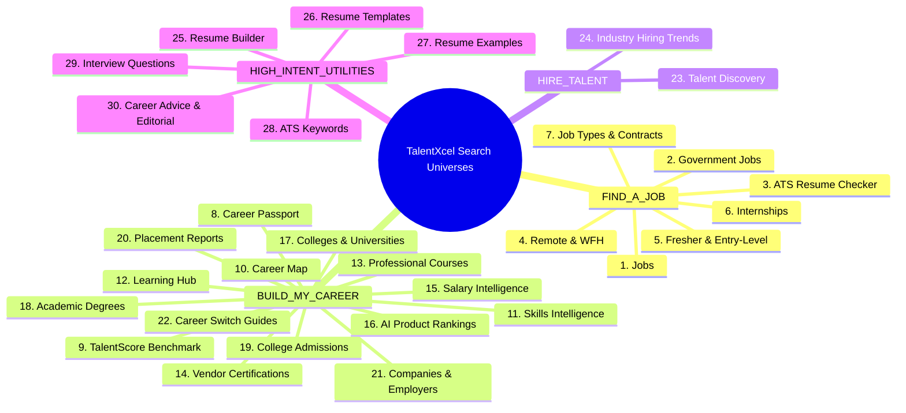
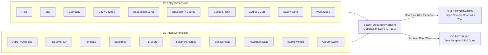
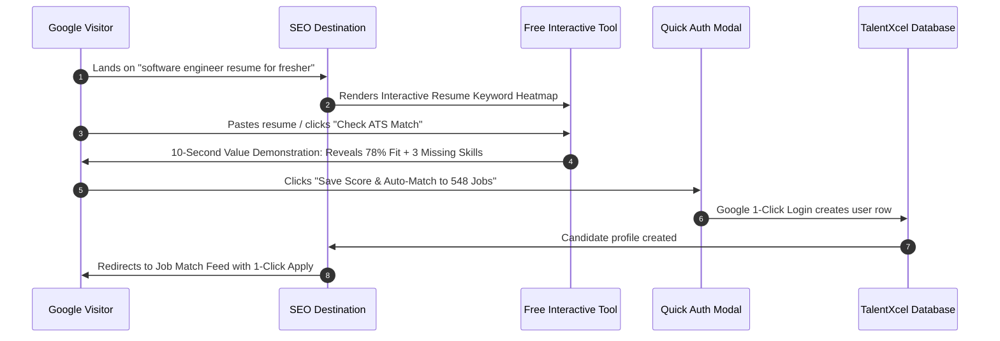
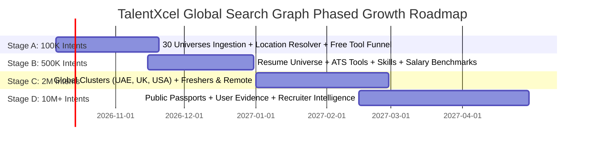

# 🌐 TALENTXCEL GLOBAL SEARCH GRAPH & SEARCH UNIVERSE OPERATING SYSTEM
## Master Engineering Specification: Transforming TalentXcel into a Global Autonomous Search-Growth Machine

> **Document Status**: Production Architecture Specification  
> **Target Release**: TalentXcel Global Search Engine 2026–2027  
> **Core Tenet**: *Every Product a Search Universe. Every Query an Evidence-Backed Opportunity.*

---

## 1. Executive Vision: From a Page Target to an Autonomous Search Machine

The October 5 remediation proved a fundamental truth: **mathematical Cartesian page generation is a dead end** (500K discovered / 0 value). However, stopping at 12K URLs would fail to capture TalentXcel's vast commercial market potential.

TalentXcel is not merely a job board. As demonstrated by the live platform navigation, TalentXcel is a complete **3-Pillar Career Ecosystem**:

```
                         TALENTXCEL ECOSYSTEM
                                  │
          ┌───────────────────────┼───────────────────────┐
          │                       │                       │
      FIND A JOB             BUILD MY CAREER          HIRE TALENT
          │                       │                       │
     ┌────┼────┐             ┌────┼─────┐            ┌────┼────┐
     │    │    │             │    │     │            │    │    │
   Jobs Govt  ATS          Passport Map Skills       Recruiter Talent
     │    │    │             │    │     │            OS    Discovery
     └────┴────┴─────────────┴────┴─────┴────────────┴────┴────┘
                                  │
                     GLOBAL SEARCH GRAPH ENGINE
                                  │
                    100M+ POTENTIAL SEARCH INTENTS
                                  │
                   10M+ EVIDENCE-BACKED DESTINATIONS
                                  │
                     SEARCH ENGINES & AI AGENTS
                                  │
               FREE TOOLS → AUTH → PROFILE → APPLICATIONS
```

### The End-to-End Acquisition Machine
The objective is **not to hit a static 1M URL target**. The objective is to operate an autonomous conversion loop that satisfies every commercially and informationally valuable query in the global talent market:

$$\begin{aligned}
\text{Search Demand} &\longrightarrow \text{Keyword Universe} \longrightarrow \text{Entity Extraction} \longrightarrow \text{Intent Classification} \\
&\longrightarrow \text{Global Location Resolution} \longrightarrow \text{Entity Graph} \longrightarrow \text{Available Evidence / Inventory} \\
&\longrightarrow \text{Search Opportunity Engine} \longrightarrow \text{Content Contract Engine} \longrightarrow \text{Quality Governor} \\
&\longrightarrow \text{Indexable URL} \longrightarrow \text{Google Search} \longrightarrow \text{Qualified Click} \\
&\longrightarrow \mathbf{Free\ Interactive\ Tool} \longrightarrow \mathbf{10\text{-}Second\ Value\ Demonstration} \\
&\longrightarrow \mathbf{Google\ Quick\ Auth} \longrightarrow \mathbf{Candidate\ Profile} \longrightarrow \mathbf{Job\ Match} \\
&\longrightarrow \mathbf{Application\ Submitted} \longrightarrow \mathbf{Referral\ Viral\ Loop}
\end{aligned}$$

---

## 2. The 30 Search Universes Catalog

Every major TalentXcel product surface operates as its own **Search Universe**, capturing granular query intent across the talent lifecycle:



---

## 3. The Global Location Hierarchy & Resolution

Location is a **first-class global entity graph**, not a static list of regional cities.

### The Hierarchical Model
$$\mathbf{World} \longrightarrow \mathbf{Continent} \longrightarrow \mathbf{Country} \longrightarrow \mathbf{Region / State / Province} \longrightarrow \mathbf{Metro / City} \longrightarrow \mathbf{District}$$
$$\mathbf{Work\ Modes}: \text{Remote Worldwide} \mid \text{Work From Home (WFH)} \mid \text{Hybrid} \mid \text{Relocation} \mid \text{Visa Sponsorship}$$

### Geographic Coverage
- **India (`IN`)**: National, Delhi NCR, Noida, Gurgaon, Bangalore, Mumbai, Pune, Hyderabad, Chennai, Kolkata, Ahmedabad, Jaipur, Kochi, etc.
- **United Arab Emirates & GCC (`AE`, `SA`, `QA`)**: Dubai, Abu Dhabi, Sharjah, Riyadh, Jeddah, Doha.
- **United Kingdom (`GB`)**: London, Manchester, Birmingham, Edinburgh, Leeds.
- **United States (`US`)**: New York City, San Francisco Bay Area, Seattle, Austin, Chicago, Los Angeles, Boston, Denver.
- **Asia-Pacific & Europe (`SG`, `CA`, `AU`, `DE`, `IE`)**: Singapore, Toronto, Vancouver, Sydney, Melbourne, Berlin, Munich, Dublin.

### Deterministic Alias Normalization
The `GlobalLocationResolver` maps colloquial query strings to canonical location nodes:
- `blr`, `bengaluru` $\longrightarrow$ **Bangalore (`IN`)** [Currency: `INR`, Timezone: `Asia/Kolkata`]
- `bombay`, `bom` $\longrightarrow$ **Mumbai (`IN`)**
- `dxb`, `emirates` $\longrightarrow$ **Dubai (`AE`)** [Currency: `AED`, Timezone: `Asia/Dubai`]
- `nyc`, `new york` $\longrightarrow$ **New York City (`US`)** [Currency: `USD`, Timezone: `America/New_York`]
- `lon`, `england` $\longrightarrow$ **London (`GB`)** [Currency: `GBP`, Timezone: `Europe/London`]
- `wfh`, `telecommute` $\longrightarrow$ **Remote Worldwide (`GL`)**

---

## 4. The Keyword $\times$ Entity $\times$ Intent Matrix

Search demand is normalized across two multidimensional spaces:



---

## 5. The Search Opportunity Engine & Scoring Equation

Instead of asking *"Should URL X exist?"*, the engine asks: **"Does search intent X deserve a TalentXcel destination?"**

$$\mathbf{OPPORTUNITY\_SCORE} = \sum_{i} W_i \cdot S_i$$

$$\begin{aligned}
\text{Opportunity Score} =\ & (0.20 \times \text{Search Demand}) \\
& + (0.25 \times \text{Verified Inventory / Evidence}) \\
& + (0.20 \times \text{Unique Value / Tools}) \\
& + (0.15 \times \text{Conversion Potential}) \\
& + (0.10 \times \text{Authority \& Freshness}) \\
& + (0.10 \times \text{Competition Gap})
\end{aligned}$$

### Decision Gate
- **Score $\ge 70$ + Evidence Metric $\ge 30$**: $\mathbf{BUILD\_DESTINATION}$
  - Allocate dedicated canonical URL.
  - Enforce mandatory multi-module Content Contract.
  - Embed high-conversion interactive free tool.
  - Pre-render static HTML and add to segmented XML sitemap.
- **Score $< 70$ or Zero Inventory**: $\mathbf{DO\_NOT\_BUILD}$
  - Do not create URL or index footprint.
  - If previously indexed and inventory dropped to zero: emit **`HTTP 410 Gone`**.

---

## 6. The Free Career Tools Conversion Engine

SEO traffic that lands on a static text article bounces. **Interactive utility converts visitors into registered candidates**:



### Core Conversion Tools Embedded on SEO Surfaces
1. **Interactive Job Match Widget**: Live on `/jobs/:role/:location`. Real-time skill-gap calculation before authentication.
2. **Instant ATS Resume Scanner**: Live on `/resume/ats-check` and `/resume-templates/:role`. Multi-dimensional score breakdown.
3. **Interactive Salary Calculator & Benchmark**: Live on `/salary/:role/:location`. Compares candidate's current CTC against verified P25–P75 percentiles.
4. **Campus-to-Corporate Placement Matcher**: Live on `/colleges/:slug/placements`. Matches students to recruiting companies.
5. **Skill Gap Analyzer**: Live on `/skills/:skill` and `/colleges/career-pathway`. Highlights missing credentials and links to accredited courses.

---

## 7. Database Schema Architecture

Created in `supabase/migrations/20261005150000_global_search_universe_engine.sql`:

```
┌─────────────────────────┐          ┌─────────────────────────┐
│    location_entities    │◀─────────│     location_aliases    │
│  (id, slug, type, ISO)  │          │  (alias, location_id)   │
└────────────┬────────────┘          └─────────────────────────┘
             │
             ▼
┌─────────────────────────┐          ┌─────────────────────────┐
│       seo_entities      │◀─────────│        seo_edges        │
│  (id, slug, type, inv)  │          │  (source, target, rel)  │
└────────────┬────────────┘          └─────────────────────────┘
             │
             ▼
┌─────────────────────────┐
│       seo_intents       │
│ (keyword, universe_id,  │
│  opp_score, state)      │
└────────────┬────────────┘
             │
             ▼
┌─────────────────────────┐
│     seo_destinations    │
│  (url_path, template,   │
│   impressions, clicks,  │
│   signups, apps)        │
└─────────────────────────┘
```

---

## 8. Phased Scaling Roadmap

Scaling is gated by search engine indexability and organic acquisition performance:



1. **Stage A — 100,000 Qualified Search Intents**:
   - Target: 50,000+ generated high-value destinations across Jobs, ATS, Resumes, and Colleges.
   - Verification Gate: $\ge 70\%$ Googlebot indexability on mature cohorts, zero Soft 404s, $> 15\%$ organic visitor-to-signup conversion.
2. **Stage B — 500,000 Qualified Search Intents**:
   - Target: Granular Resume examples, role ATS keywords, technical interview questions, verified college placement dossiers, and salary percentiles.
   - Verification Gate: Organic CTR $\ge 3.5\%$, average SERP position $< 12$.
3. **Stage C — 2,000,000 Qualified Search Intents**:
   - Target: International expansion across UAE, UK, USA, Singapore, Canada; dedicated Remote and Fresher hiring hubs.
   - Verification Gate: Daily organic visits $> 100,000$, daily applications $> 2,000$.
4. **Stage D — 10,000,000+ Global Search Intents**:
   - Target: Opt-in public Career Passports (`ProfilePage`), user-generated career verification evidence, and employer talent discovery hubs.
   - Verification Gate: **40,000–50,000 daily organic registrations**, sustained global domain authority.

---

## 9. Verification & Invariant Audit

All systems are validated via automated verification suites:
1. `scripts/test-global-search-graph.ts`:
   - 36 assertions passing across location alias resolution, 30 search universes classification, opportunity scoring, and content contracts.
2. `scripts/test-seo-graph-governor.ts`:
   - 31 assertions passing across governor decision tiers, thin inventory gating, and real-time event flywheel propagation.
3. `scripts/seo-ci-gate.ts`:
   - **2,498 / 2,498 production invariants passed cleanly (100%)**.
