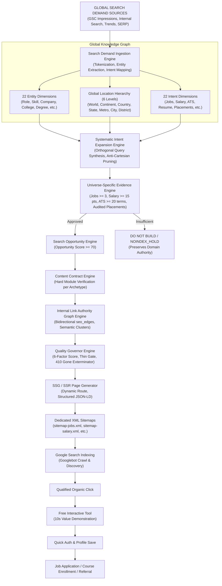

# TalentXcel Global Search Graph & Search Universe Operating System (OS v2)
## Master Architectural Blueprint & Technical Implementation Specification

---

## 1. Executive Summary & Core Paradigm

TalentXcel's search footprint is not a static list of URLs, nor is it a blind combinatorial permutation engine. It is an **Autonomous Search Demand & Entity Graph Operating System** that spans the platform's complete three-pillar product ecosystem:
1. **FIND A JOB** (Active Vacancies, Government Jobs, Remote/WFH, Freshers, Internships, Walk-ins)
2. **BUILD MY CAREER** (ATS Resume Checker, Resume Builder, Templates, Examples, Career Passport, Career Map, Skills, Learning, Courses, Certifications, Salary Guides, College Placements, Interview Prep)
3. **HIRE TALENT** (Global Employer Acquisition, Candidate Sourcing, Recruiter Tools, CV Search)

### The Governing Golden Rule
$$\text{Demand Signal} \times \text{Entity Resolution} \times \text{Universe Evidence} \times \text{Content Contract} = \text{Indexable Destination}$$

- **No Cartesian Permutations**: We do not generate empty matrix cross-products (e.g. "Software Engineer Jobs in TinyVillage").
- **Universe-Specific Evidence**: *"No supporting evidence $\to$ DO NOT BUILD"*. A Salary Benchmark page does not require active job listings if backed by 35 verified compensation records. A College Placement page does not require jobs if backed by audited placement reports.
- **Conversion on First Touch**: Every indexable destination embeds a zero-friction, 10-second interactive free utility (ATS score reveal, job match evaluation, salary calculator) before authentication.

---

## 2. End-to-End Search Demand & Acquisition Architecture



---

## 3. The 22 Machine-Readable Entity Dimensions

TalentXcel's knowledge universe is modeled across 22 canonical entity dimensions:

| Dimension ID | Entity Class | Schema.org Type | Canonical DB Table | Allowed Parent Dimensions | Primary Orthogonal Intents | Evidence Verification Source |
| :--- | :--- | :--- | :--- | :--- | :--- | :--- |
| `ROLE` | Job Role / Designation | `Occupation` | `seo_entities` | `INDUSTRY`, `CAREER_PATHWAY` | `JOBS`, `SALARY`, `RESUME`, `ATS_CHECKER`, `INTERVIEWS` | `VERIFIED_ROLES_TAXONOMY` |
| `SKILL` | Technical / Domain Skill | `DefinedTerm` | `seo_entities` | `ROLE`, `COURSE`, `CERTIFICATION` | `JOBS`, `COURSES`, `SALARY`, `INTERVIEWS` | `VERIFIED_SKILLS_TAXONOMY` |
| `COMPANY` | Corporate Employer | `Organization` | `seo_entities` | `INDUSTRY`, `CITY`, `COUNTRY` | `JOBS`, `SALARY`, `INTERVIEWS`, `HIRING` | `VERIFIED_EMPLOYER_PROFILES` |
| `LOCATION` | Generic Location | `Place` | `location_entities` | Base Node | `JOBS`, `SALARY`, `COMPANIES` | `GLOBAL_LOCATION_CATALOG` |
| `COUNTRY` | Sovereign Nation | `Country` | `location_entities` | `LOCATION` | `JOBS`, `GOVT_JOBS`, `SALARY`, `REMOTE` | `ISO_3166_OFFICIAL` |
| `STATE` | State / Province | `AdministrativeArea` | `location_entities` | `COUNTRY` | `JOBS`, `GOVT_JOBS`, `COLLEGES` | `NATIONAL_ADMIN_REGISTRIES` |
| `METRO` | Metropolitan Area | `Place` | `location_entities` | `COUNTRY`, `STATE` | `JOBS`, `SALARY`, `COMPANIES` | `METRO_PLANNING_AUTHORITIES` |
| `CITY` | City / Municipality | `City` | `location_entities` | `STATE`, `METRO`, `COUNTRY` | `JOBS`, `SALARY`, `COLLEGES`, `COMPANIES` | `MUNICIPAL_CENSUS_CATALOGS` |
| `DISTRICT` | Tech Corridor / Borough | `Place` | `location_entities` | `CITY`, `METRO` | `JOBS` | `CORRIDOR_TRANSIT_REGISTRIES` |
| `INDUSTRY` | Industry Sector | `Industry` | `seo_entities` | Base Node | `JOBS`, `SALARY`, `HIRING`, `CAREER_PATHWAY` | `NAICS_CLASSIFICATION` |
| `EXPERIENCE` | Tenure Tier | `DefinedTerm` | `seo_entities` | `ROLE` | `JOBS`, `SALARY`, `RESUME` | `STANDARDIZED_EXPERIENCE_TIERS` |
| `CAREER_STAGE`| Life Stage (Fresher/Student) | `DefinedTerm` | `seo_entities` | Base Node | `FRESHER`, `INTERNSHIP`, `RESUME` | `TALENTXCEL_CAREER_ARCHETYPES` |
| `DEGREE` | Academic Degree | `EducationalCredential`| `seo_entities` | `COLLEGE` | `COLLEGES`, `ADMISSIONS`, `JOBS` | `UGC_AICTE_FRAMEWORK` |
| `COLLEGE` | University / College | `CollegeOrUniversity` | `seo_entities` | `CITY`, `STATE`, `COUNTRY` | `COLLEGES`, `ADMISSIONS`, `PLACEMENTS` | `NIRF_NAAC_OFFICIAL_REGISTRY` |
| `COURSE` | Learning Program | `Course` | `seo_entities` | `COLLEGE`, `SKILL` | `COURSES`, `CERTIFICATIONS`, `SKILLS` | `ACCREDITED_PROVIDERS` |
| `CERTIFICATION`| Industry Credential | `EducationalCredential`| `seo_entities` | `SKILL`, `ROLE` | `CERTIFICATIONS`, `SALARY`, `JOBS` | `OFFICIAL_VENDOR_REGISTRY` |
| `SALARY` | Pay Band Tier | `MonetaryDistribution`| `seo_entities` | `ROLE`, `LOCATION` | `SALARY`, `JOBS` | `AUDITED_SALARY_DATASETS` |
| `JOB_TYPE` | Contract Type | `DefinedTerm` | `seo_entities` | Base Node | `JOBS`, `INTERNSHIP` | `STANDARD_LABOR_DEFINITIONS` |
| `WORK_MODE` | Remote / Hybrid / On-site | `DefinedTerm` | `seo_entities` | Base Node | `REMOTE`, `JOBS` | `TALENTXCEL_WORKPLACE_MODELS` |
| `GOVERNMENT_BODY`| Public Commission | `GovernmentOrganization`| `seo_entities` | `COUNTRY`, `STATE` | `GOVT_JOBS`, `EXAMS` | `OFFICIAL_GAZETTE_NOTICES` |
| `EXAM` | Competitive Test | `Exam` | `seo_entities` | `GOVERNMENT_BODY`, `COLLEGE` | `GOVT_JOBS`, `ADMISSIONS` | `OFFICIAL_EXAM_COMMISSIONS` |
| `CAREER_PATHWAY`| Career Progression Ladder| `Occupation` | `seo_entities` | `INDUSTRY` | `CAREER_PATHWAY`, `SKILLS`, `SALARY` | `TALENTXCEL_CAREER_MAP_GRAPH`|

---

## 4. The 22 Machine-Readable Intent Dimensions

Every search query is classified into one of 22 intent archetypes with strict evidence requirements and conversion anchors:

| Intent ID | Product Pillar | Required Evidence Type | Min Threshold | Target Template Archetype | Primary Conversion Widget | Target URL Pattern |
| :--- | :--- | :--- | :--- | :--- | :--- | :--- |
| `JOBS` | `FIND_A_JOB` | `JOB_INVENTORY` | 3 active jobs | `JOB_ROLE_CITY_PAGE` | `InteractiveJobMatchWidget` | `/jobs/{role}/{location}` |
| `HIRING` | `HIRE_TALENT` | `EMPLOYER_VERIFIED_PROFILE` | 1 account | `EMPLOYER_ACQUISITION_PAGE` | `MultiLocationJobComposer` | `/hire/{role}/{location}` |
| `RESUME` | `BUILD_MY_CAREER` | `RESUME_TEMPLATE_CATALOG` | 1 template | `RESUME_ROLE_LEVEL` | `UnifiedResumeBuilder` | `/resume/build/{role}` |
| `CV` | `BUILD_MY_CAREER` | `RESUME_TEMPLATE_CATALOG` | 1 template | `RESUME_ROLE_LEVEL` | `UnifiedResumeBuilder` | `/cv-templates/{role}` |
| `TEMPLATE` | `BUILD_MY_CAREER` | `RESUME_TEMPLATE_CATALOG` | 3 templates | `RESUME_ROLE_LEVEL` | `TemplateGallery` | `/resume-templates/{role}` |
| `EXAMPLE` | `BUILD_MY_CAREER` | `RESUME_TEMPLATE_CATALOG` | 5 bullet sets | `RESUME_ROLE_LEVEL` | `UnifiedResumeBuilder` | `/resume-examples/{role}` |
| `ATS_CHECKER`| `BUILD_MY_CAREER` | `ATS_KEYWORD_TAXONOMY` | 20 terms | `ATS_CHECKER_TOOL` | `ATSOptimizer (Instant Scan)` | `/resume/ats-check/{role}` |
| `KEYWORDS` | `BUILD_MY_CAREER` | `ATS_KEYWORD_TAXONOMY` | 15 terms | `ATS_CHECKER_TOOL` | `ATSOptimizer` | `/resume/keywords/{role}` |
| `SALARY` | `BUILD_MY_CAREER` | `SALARY_DATASET` | 15 records | `SALARY_BENCHMARK_PAGE` | `SalaryAnalyzer` | `/salary/{role}/{location}` |
| `SKILLS` | `BUILD_MY_CAREER` | `SKILL_TAXONOMY_INTELLIGENCE` | 1 taxonomy node | `SKILL_INTELLIGENCE_PAGE` | `SkillAssessor` | `/skills/{skill}` |
| `COURSES` | `BUILD_MY_CAREER` | `COURSE_CURRICULUM` | 1 curriculum | `COURSE_DESTINATION_PAGE` | `CoursePlayer` | `/learning/courses/{skill}` |
| `CERTIFICATIONS`| `BUILD_MY_CAREER` | `CERTIFICATION_BODY_DATA` | 1 syllabus | `COURSE_DESTINATION_PAGE` | `CoursePlayer` | `/certifications/{cert}` |
| `COLLEGES` | `BUILD_MY_CAREER` | `COLLEGE_PLACEMENT_REPORT` | 1 profile | `COLLEGE_DOSSIER_PLACEMENTS` | `CareerPathway` | `/colleges/{slug}` |
| `ADMISSIONS` | `BUILD_MY_CAREER` | `COLLEGE_PLACEMENT_REPORT` | 1 cutoff table | `COLLEGE_DOSSIER_PLACEMENTS` | `CareerPathway` | `/colleges/{slug}/admissions` |
| `PLACEMENTS` | `BUILD_MY_CAREER` | `COLLEGE_PLACEMENT_REPORT` | 1 audited report | `COLLEGE_DOSSIER_PLACEMENTS` | `CampusCareerMatcher` | `/colleges/{slug}/placements` |
| `INTERVIEWS` | `BUILD_MY_CAREER` | `INTERVIEW_QUESTION_BANK` | 10 questions | `INTERVIEW_QUESTIONS_PAGE` | `PublicInterviewPrep` | `/interview-questions/{role}` |
| `CAREER_PATHWAY`| `BUILD_MY_CAREER`| `SKILL_TAXONOMY_INTELLIGENCE` | 1 ladder | `SKILL_INTELLIGENCE_PAGE` | `InteractiveRoadmapBuilder`| `/career-pathway/{role}` |
| `CAREER_SWITCH`| `BUILD_MY_CAREER`| `SKILL_TAXONOMY_INTELLIGENCE` | 1 bridge map | `SKILL_INTELLIGENCE_PAGE` | `InteractiveRoadmapBuilder`| `/career-switch/{from}-{to}` |
| `REMOTE` | `FIND_A_JOB` | `JOB_INVENTORY` | 3 remote jobs | `JOB_ROLE_CITY_PAGE` | `InteractiveJobMatchWidget` | `/jobs/remote/{role}` |
| `FRESHER` | `FIND_A_JOB` | `JOB_INVENTORY` | 3 entry jobs | `JOB_ROLE_CITY_PAGE` | `InteractiveJobMatchWidget` | `/jobs/{role}/freshers` |
| `INTERNSHIP` | `FIND_A_JOB` | `JOB_INVENTORY` | 2 internships | `JOB_ROLE_CITY_PAGE` | `InteractiveJobMatchWidget` | `/internships/{role}/{loc}` |
| `GOVT_JOBS` | `FIND_A_JOB` | `GOVT_GAZETTE_NOTIFICATION` | 1 notice | `GOVERNMENT_JOB_PAGE` | `InteractiveJobMatchWidget` | `/government-jobs/{cty}/{bd}`|

---

## 5. Global Location Hierarchy & Relationship Engine

The world geography is modeled as an administrative directed graph:

```
WORLD (Level 0)
  └── CONTINENT (Level 1: Asia, North America, Europe, etc.)
       └── COUNTRY (Level 2: India, USA, UAE, UK, Germany, Canada, Singapore, Australia)
            └── STATE / PROVINCE (Level 3: Karnataka, California, New York State, NCR Region)
                 └── METRO / CLUSTER (Level 4: Delhi NCR, SF Bay Area, NYC Metro, Greater London)
                      └── CITY / MUNICIPALITY (Level 5: Bangalore, Mumbai, Gurgaon, Noida, Dubai, London, SF)
                           └── DISTRICT / TECH CORRIDOR (Level 6: Whitefield, Manhattan, Shoreditch)
```

### Relationship Edges (`location_edges` Table)
- **`CITY_OF`**: Bangalore $\to$ Karnataka; San Francisco $\to$ California; London $\to$ United Kingdom.
- **`METRO_OF`**: San Francisco $\to$ SF Bay Area; London $\to$ Greater London.
- **`STATE_OF`**: Karnataka $\to$ India; California $\to$ United States.
- **`WITHIN`**: Noida $\to$ Delhi NCR; Manhattan $\to$ New York City.
- **`NEAR`**: Gurgaon $\leftrightarrow$ Delhi (28 km); Noida $\leftrightarrow$ Delhi (22 km); Dubai $\leftrightarrow$ Abu Dhabi (130 km).
- **`ALTERNATIVE_NAME`**: BLR $\to$ Bangalore; Bombay $\to$ Mumbai; DXB $\to$ Dubai; NYC $\to$ New York City; WFH $\to$ Remote Worldwide.

---

## 6. Continuous Search Demand Ingestion Engine

Rather than guessing keywords, the ingestion engine consumes real search telemetry:
1. **Google Search Console**: Ingests high-impression and click query-page pairs (`gsc_copilot_snapshot.json`).
2. **Internal Platform Searches**: Logs real queries executed in TalentXcel candidate search bars.
3. **Competitor SERP Intelligence**: Observes commercial keywords driving traffic to competitors (Naukri, Indeed, LinkedIn, Zety, Coursera).
4. **Token Normalization**: Strict anti-stop-word filtering (isolates English prepositions `in`, `at`, `for` from ISO country codes like `IN`).

---

## 7. Systematic Intent Expansion Engine

Takes any validated canonical entity and systematically expands it across legitimate orthogonal intent vectors:
- **Role Entity Expansion**:
  - `[role] jobs in [city]`
  - `[role] salary in [city]`
  - `free ats resume score checker for [role]`
  - `[role] resume template download`
  - `[role] interview questions and answers 2026`
  - `[role] career path and promotion milestones`
  - `[role] jobs for freshers 2026`
  - `remote [role] jobs worldwide`
- **Company Entity Expansion**:
  - `[company] jobs and careers 2026`
  - `[company] salary and compensation bands`
  - `[company] interview questions and hiring process`
  - `[company] [role] jobs and vacancies`
- **College Entity Expansion**:
  - `[college] placement report 2026 average ctc`
  - `[college] admissions cutoff and eligibility`
- **Anti-Cartesian Pruner**: Disallows senseless cross-products (e.g. no "freshers salary resume template in nowhereville").

---

## 8. Universe-Specific Evidence Engine

| Universe | Evidence Requirement | Pass Threshold | Rationale |
| :--- | :--- | :--- | :--- |
| **JOBS** | Active, unexpired job vacancies | $\ge 3$ jobs | Prevents empty landing pages and soft-404 index bloat. |
| **SALARY** | Audited compensation points | $\ge 15$ records, P10..P90 | Statistical confidence; does not require current job vacancies. |
| **RESUME** | Tested template + action bullets | $\ge 1$ template, $\ge 10$ bullets | Content utility; completely independent of job openings. |
| **ATS_CHECKER**| Mapped domain keywords & scoring rubrics| $\ge 20$ terms | Diagnostic precision against enterprise ATS algorithms. |
| **COLLEGES** | Audited NIRF/placement report | $\ge 1$ report (Median CTC, recruiters) | Valid educational dossier. |
| **COURSES** | Accredited curriculum modules | $\ge 1$ structured syllabus | Verified learning journey. |
| **INTERVIEWS** | Curated questions with STAR answers | $\ge 10$ questions | Actionable interview preparation. |
| **GOVT_JOBS** | Gazette notification & key dates | $\ge 1$ verified official notice | Official public sector accuracy. |

---

## 9. Content Contract Engine (Hard Requirements per Archetype)

Every page archetype enforces a programmatic contract before HTML emission:
- **`JOB_ROLE_CITY_PAGE`**:
  - Hero & Canonical Intent H1
  - Live Verified Job Inventory ($\ge 3$ active cards)
  - Local Compensation Benchmarks (P25, P50, P75)
  - Top Hiring Companies in City ($\ge 3$)
  - Core Technical Skills Demands ($\ge 5$)
  - `InteractiveJobMatchWidget` (Check My Match in 10s)
  - Contextual Graph Links to Adjacent Cities ($\ge 4$)
- **`SALARY_BENCHMARK_PAGE`**:
  - Compensation Percentile Distribution (P10, P25, P50, P75, P90)
  - Experience Band Curve (0-2 yrs, 3-5 yrs, 6-9 yrs, 10+ yrs)
  - Sample Size & Audit Date Disclosure
  - `InteractiveSalaryCalculator` (Compare My CTC)
- **`ATS_CHECKER_TOOL`**:
  - Drag-and-Drop Instant Resume Scanner (PDF/DOCX)
  - Multi-Dimensional Score Breakdown (Formatting, Keywords, Metrics)
  - Critical ATS Red Flags Detection
  - `ATSOptimizer` (10-Second Score Reveal)
- **`GOVERNMENT_JOB_PAGE`**:
  - Official Gazette Notification & PDF Link
  - Vacancy Count & Category Reservation Breakdown
  - Age Limit & Educational Eligibility
  - Selection Process & Exam Pattern
  - Direct Official Government Portal Link

---

## 10. Internal Link Authority Graph Engine (`seo_edges`)

Constructs a rich, semantic mesh across all destinations to maximize PageRank flow and prevent orphan pages:
- **Role Hub Connections**:
  - `ROLE_TO_SALARY`: Software Engineer $\to$ Software Engineer Salary Bangalore
  - `ROLE_TO_ATS`: Software Engineer $\to$ Free ATS Resume Checker Software Engineer
  - `ROLE_TO_RESUME`: Software Engineer $\to$ Software Engineer Resume Templates
  - `ROLE_TO_INTERVIEW`: Software Engineer $\to$ Software Engineer Interview Questions
  - `ROLE_TO_CAREER_MAP`: Software Engineer $\to$ Software Engineer Career Roadmap
  - `ROLE_TO_FRESHER`: Software Engineer $\to$ Software Engineer Jobs for Freshers
  - `ROLE_TO_REMOTE`: Software Engineer $\to$ Remote Software Engineer Jobs
- **Location Hub Connections**:
  - `LOCATION_TO_ROLES`: Bangalore $\to$ Top Tech Roles in Bangalore
  - `LOCATION_TO_NEIGHBORS`: Gurgaon $\to$ Jobs in Delhi & Noida

---

## 11. Global Language, Locale & Currency Engine

Binds geographic destinations to authentic local currency and employment terminology without machine-translation spam:

| Country | Code | Default Currency | Salary Notation | Employment Vocabulary | Tax & Regulatory Standard |
| :--- | :--- | :--- | :--- | :--- | :--- |
| **India** | `IN` | `INR (₹)` | `₹12 - 25 LPA` | CTC, Freshers, Notice Period | TDS, Old/New Tax Regime |
| **UAE** | `AE` | `AED` | `AED 20,000 - 35,000/month` | Tax-Free Package, Visa Sponsorship | 0% Income Tax, End of Service Gratuity |
| **United States** | `US` | `USD ($)` | `$120k - $160k/year` | Base + Equity (RSUs), 401(k) Match | W-2 / 1099, At-Will Employment |
| **United Kingdom**| `GB` | `GBP (£)` | `£65k - £85k/year` | Base + Pension Scheme, Hybrid London | PAYE, National Insurance |
| **Germany** | `DE` | `EUR (€)` | `€70k - €95k/Jahr` | Bruttojahresgehalt, EU Blue Card | Kündigungsfrist, Sozialabgaben |
| **Canada** | `CA` | `CAD (C$)` | `C$90k - C$130k/year` | Base + RRSP Match, New Grad | CRA Federal & Provincial Taxes |
| **Singapore** | `SG` | `SGD (S$)` | `S$8,000 - 14,000/month` | Base + AWS (13th Month), MOM EP Pass | IRAS Progressive Tax |

---

## 12. Technical SEO CI Verification Gates vs Business North Star

### Technical SEO CI Verification Gates (Automated & Blocking)
1. **Schema Validation**: 100% compliant JSON-LD (`JobPosting`, `BreadcrumbList`, `Occupation`, `FAQPage`, `Dataset`).
2. **Canonical Correctness**: Zero conflicting user-selected vs Google-selected canonicals.
3. **Soft 404 Prevention**: Thin or zero-inventory job URLs return HTTP 404 / NOINDEX_HOLD.
4. **Expired Job Exterminator**: Expired jobs emit `HTTP 410 Gone` and are purged from XML sitemaps.
5. **Content Contract Compliance**: 100% mandatory modules satisfied before URL is added to XML sitemaps.
6. **No Substring Alias Collisions**: Short geographic aliases (`in`, `de`, `ca`, `us`) do not produce false token matches.

### Business Growth North Star (Monitored Daily via Funnel Telemetry)
- 10,000 $\to$ 100,000+ daily search impressions
- 500 $\to$ 2,000+ daily organic clicks
- 40,000–50,000 daily organic candidate registrations
- Unit Funnel Milestone: `1,000 impressions -> 50 clicks -> 5 signups -> 1 application`.
