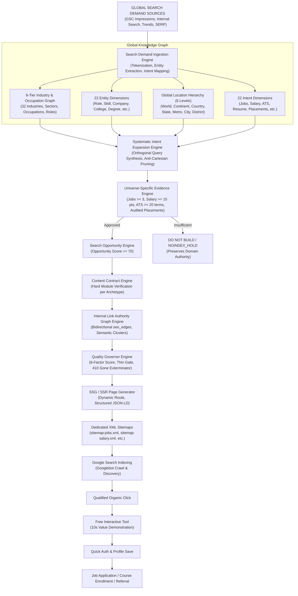
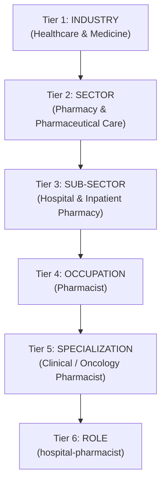
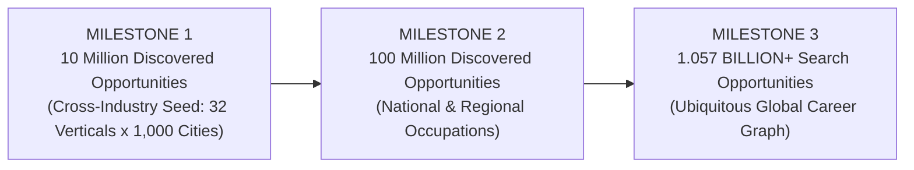

# TalentXcel Global Search Graph & Search Universe Operating System (OS v2)
## Master Architectural Blueprint & Technical Implementation Specification

---

## 1. Executive Summary & Core Paradigm

TalentXcel's search footprint is not an IT jobs board, nor a static directory of URLs, nor a blind combinatorial permutation engine. It is the **World's Largest Global Career Search & Intelligence Graph** covering **every profession, occupation, and industry worldwide**.

TalentXcel's architecture addresses the complete three-pillar career ecosystem:
1. **FIND A JOB** (Active Vacancies, Government Jobs, Remote/WFH, Freshers, Internships, Walk-ins, Multi-City Matrix across 32 Global Industries)
2. **BUILD MY CAREER** (ATS Resume Checker, Resume Builder, Templates, Examples, Career Passport, Career Map, Skills, Learning, Courses, Certifications, Salary Guides, College Placements, Interview Prep)
3. **HIRE TALENT** (Global Employer Acquisition, Candidate Sourcing, Recruiter Tools, CV Search)

### The Governing Golden Rule
$$\text{Demand Signal} \times \text{Entity Resolution} \times \text{Universe Evidence} \times \text{Content Contract} = \text{Indexable Destination}$$

- **No Cartesian Permutations**: We do not generate empty matrix cross-products (e.g. "Software Engineer Jobs in TinyVillage").
- **Universe-Specific Evidence**: *"No supporting evidence $\to$ DO NOT BUILD"*. A Salary Benchmark page does not require active job listings if backed by 15+ verified compensation records. A College Placement page does not require jobs if backed by audited placement reports.
- **Conversion on First Touch**: Every indexable destination embeds a zero-friction, 10-second interactive free utility (ATS score reveal, job match evaluation, salary calculator) before authentication.
- **Career-Centric, Not IT-Centric**: IT is only 1 of 32 global verticals. Healthcare (doctors, nurses, pharmacists), BFSI (bank branch managers, credit analysts), Construction (civil engineers, architects), Aviation (commercial pilots), Hospitality (hotel managers, head chefs), and Manufacturing (plant managers, CNC operators) are first-class peers.

### The Architectural Scale North Star
- **$\ge 1$ BILLION+ Potential Search Opportunities** ($646\text{M} - 1.78\text{B}+$ raw search intent universe)
- **100M – 250M+ Qualified Search Opportunities** (Target: **241 Million**, strictly evidence-backed)
- **20M – 100M+ Buildable Destinations** (Target: **73 Million**, governed by content contracts)
- **10M – 50M+ Quality Indexable URL Capacity** (Target: **22.6 Million**, governor-controlled, zero thin crawl bloat)

---

## 2. End-to-End Search Demand & Acquisition Architecture



---

## 3. The 6-Tier Multi-Industry & Occupation Hierarchy

TalentXcel structures all global work through a formalized 6-Tier Knowledge Graph:

$$\text{Tier 1: Industry} \to \text{Tier 2: Sector} \to \text{Tier 3: Sub-Sector} \to \text{Tier 4: Occupation} \to \text{Tier 5: Specialization} \to \text{Tier 6: Role}$$



### 32 Canonical Global Industry Verticals
1. **Healthcare & Medicine** (Doctors, Nurses, Pharmacists, Radiologists, Lab Technicians)
2. **Banking, Financial Services & Insurance (BFSI)** (Relationship Managers, Credit Analysts, Actuaries, Branch Managers)
3. **Hospitality, Travel & Tourism** (Hotel General Managers, Executive Chefs, F&B Directors, Concierge)
4. **Construction, Civil & Real Estate** (Civil Engineers, Structural Engineers, Quantity Surveyors, Architects)
5. **Aviation, Aerospace & Defense** (Commercial Pilots, First Officers, Flight Attendants, Air Traffic Controllers, Avionics Engineers)
6. **Automotive & Future Mobility** (Automotive Engineers, EV Powertrain Engineers, Diagnostic Technicians)
7. **Manufacturing, Industrial & Heavy Machinery** (Plant Managers, Industrial Engineers, CNC Operators, Quality Engineers)
8. **Supply Chain, Logistics & Maritime** (Logistics Directors, Warehouse Managers, Customs Officers, Marine Engineers)
9. **Education, Higher Ed & Academia** (Professors, High School Teachers, Instructional Designers, Principals)
10. **Legal, Judiciary & Compliance** (Corporate Lawyers, Regulatory Compliance Officers, Legal Counsel, Paralegals)
11. **Agriculture, Agritech & Food Processing** (Agronomists, Farm Managers, Food Safety Scientists)
12. **Media, Journalism & Creative Arts** (Journalists, Video Producers, Creative Directors, Animators)
13. **Energy, Utilities & Renewables** (Petroleum Engineers, Solar PV Specialists, Power Grid Operators)
14. **Government, Civil Services & Public Administration** (Civil Servants, Police Officers, Tax Inspectors)
15. **Retail, Consumer Goods & E-Commerce** (Store Managers, Merchandisers, Category Managers)
16. **IT, Software & Cybersecurity** (Software Engineers, Cloud Architects, Cybersecurity Specialists)
17. *(Plus 16 additional global sectors covering Telecommunications, Biotechnology, Mining, Chemical, Marine, Non-Profit, Defense, etc.)*

### Cross-Connected to 22 Intent Dimensions
Each occupation connects orthogonally to the 22 intent archetypes:
- `pharmacist jobs in srinagar` $\to$ `/jobs/pharmacist/srinagar`
- `pharmacist salary in dubai` $\to$ `/salary/pharmacist/dubai`
- `pharmacist resume examples` $\to$ `/resume/examples/pharmacist`
- `pharmacist ats keywords` $\to$ `/resume/ats-check/pharmacist`
- `pharmacist interview questions` $\to$ `/interview-questions/pharmacist`
- `pharmacist government jobs` $\to$ `/government-jobs?role=pharmacist`
- `hotel manager jobs in london` $\to$ `/jobs/hotel-manager/london`
- `hotel manager salary` $\to$ `/salary/hotel-manager`
- `civil engineer jobs in dubai` $\to$ `/jobs/civil-engineer/dubai`
- `commercial pilot salary in dubai` $\to$ `/salary/commercial-pilot/dubai`

---

## 4. TalentXcel Global Search Universe — 1.057 Billion Target Catalog

The platform registers **31 Search Universes** calibrated to capture over **1.057 Billion** search keywords with **73 Million** buildable destinations and **22.6 Million** indexable quality pages:

| Universe ID | Category Name | Pillar | Keyword Universe (Min–Max) | Keyword Target | Qualified Intents | Destination Target | Indexable Capacity | Priority | Evidence Source |
| :--- | :--- | :--- | :--- | :--- | :--- | :--- | :--- | :--- | :--- |
| `JOBS` | Active Jobs & Vacancies | `FIND_A_JOB` | 80M – 200M | **120,000,000** | 25,000,000 | **10,000,000** | 3,000,000 | 🔴 Critical | Job Inventory ($\ge 3$ jobs) |
| `GOVERNMENT_JOBS` | Government & Public Sector | `FIND_A_JOB` | 15M – 40M | **25,000,000** | 6,000,000 | **2,000,000** | 600,000 | 🔴 Critical | Official Gazette Notice |
| `COMPANIES` | Companies & Employers Hub | `FIND_A_JOB` | 20M – 60M | **35,000,000** | 8,000,000 | **3,500,000** | 1,000,000 | 🔴 Critical | Verified Employer Profile |
| `RESUMES` | Resume Builder | `BUILD_MY_CAREER` | 5M – 15M | **10,000,000** | 2,500,000 | **800,000** | 250,000 | 🔴 Critical | Role Builder Modules |
| `RESUME_TEMPLATES` | Resume Templates | `BUILD_MY_CAREER` | 8M – 25M | **15,000,000** | 3,500,000 | **1,200,000** | 400,000 | 🔴 Critical | Curated Templates |
| `RESUME_EXAMPLES` | Resume Examples | `BUILD_MY_CAREER` | 25M – 75M | **45,000,000** | 10,000,000 | **3,500,000** | 1,100,000 | 🔴 Critical | Bullet Point Banks |
| `ATS_CHECKER` | Free ATS Resume Checker | `BUILD_MY_CAREER` | 15M – 45M | **25,000,000** | 5,000,000 | **1,800,000** | 600,000 | 🔴 Critical | ATS Keyword Taxonomy |
| `ATS_KEYWORDS` | High-Impact ATS Keywords | `BUILD_MY_CAREER` | 25M – 70M | **40,000,000** | 8,000,000 | **2,500,000** | 800,000 | 🔴 Critical | Frequency Heatmap |
| `CAREER_MAP` | Career Roadmap & Progression | `BUILD_MY_CAREER` | 10M – 30M | **15,000,000** | 3,500,000 | **1,200,000** | 400,000 | 🔴 Critical | Career Progression Ladder |
| `SKILLS` | Skills Intelligence & Value | `BUILD_MY_CAREER` | 20M – 55M | **30,000,000** | 7,000,000 | **2,200,000** | 700,000 | 🔴 Critical | Skill Demand & Premium |
| `SALARY` | Salary Benchmarks & Pay Bands| `BUILD_MY_CAREER` | 35M – 100M | **60,000,000** | 15,000,000 | **5,000,000** | 1,500,000 | 🔴 Critical | Audited P10..P90 Dataset ($\ge 15$) |
| `INTERVIEW_QUESTIONS`| Interview Questions & STAR | `BUILD_MY_CAREER` | 20M – 60M | **35,000,000** | 8,000,000 | **3,000,000** | 1,000,000 | 🔴 Critical | Curated Questions ($\ge 10$) |
| `COURSES` | Online Courses & Bootcamps | `BUILD_MY_CAREER` | 20M – 55M | **30,000,000** | 7,000,000 | **2,500,000** | 800,000 | 🔴 Critical | Accredited Curriculum |
| `CERTIFICATIONS` | Industry Certifications | `BUILD_MY_CAREER` | 10M – 30M | **18,000,000** | 4,000,000 | **1,500,000** | 500,000 | 🟠 High | Official Board Data |
| `COLLEGES` | Colleges Directory | `BUILD_MY_CAREER` | 10M – 25M | **15,000,000** | 3,500,000 | **1,200,000** | 450,000 | 🔴 Critical | 10,250+ College NIRF Profiles |
| `DEGREES` | Degrees & Academic Programs | `BUILD_MY_CAREER` | 12M – 35M | **20,000,000** | 5,000,000 | **1,800,000** | 600,000 | 🔴 Critical | Academic Curriculum |
| `ADMISSIONS` | College Admissions & Cutoffs | `BUILD_MY_CAREER` | 12M – 35M | **20,000,000** | 5,000,000 | **1,800,000** | 600,000 | 🟠 High | Official Cutoff Records |
| `PLACEMENTS` | Audited Campus Placements | `BUILD_MY_CAREER` | 6M – 18M | **10,000,000** | 2,500,000 | **800,000** | 250,000 | 🟠 High | Audited Placement Reports |
| `CAREER_PASSPORT` | Verified Career Passports | `BUILD_MY_CAREER` | 70M – 200M | **120,000,000** | 30,000,000 | **6,000,000** | 1,500,000 | 🔴 Critical | Verified Candidate Profiles |
| `TALENTSCORE` | TalentScore Benchmarks | `BUILD_MY_CAREER` | 10M – 25M | **15,000,000** | 3,500,000 | **1,200,000** | 400,000 | 🟠 High | Percentile Assessment Rubrics |
| `REMOTE` | Remote & WFH Jobs Worldwide | `FIND_A_JOB` | 18M – 50M | **30,000,000** | 7,000,000 | **2,200,000** | 700,000 | 🔴 Critical | Remote Listings ($\ge 3$) |
| `FRESHER` | Freshers & Entry-Level Jobs | `FIND_A_JOB` | 18M – 50M | **30,000,000** | 7,000,000 | **2,200,000** | 700,000 | 🔴 Critical | 0-1 Yr Vacancies ($\ge 3$) |
| `INTERNSHIPS` | Internships & Traineeships | `FIND_A_JOB` | 12M – 35M | **22,000,000** | 5,000,000 | **1,800,000** | 600,000 | 🔴 Critical | Traineeships ($\ge 2$) |
| `JOB_TYPES` | Job Types & Contracts | `FIND_A_JOB` | 10M – 25M | **15,000,000** | 3,000,000 | **1,000,000** | 300,000 | 🟠 High | Contract Listings |
| `INDUSTRIES` | Industry Sectors & Verticals | `FIND_A_JOB` | 10M – 30M | **18,000,000** | 4,000,000 | **1,400,000** | 450,000 | 🟠 High | 32 Vertical Industry Hubs |
| `RECRUITERS` | Employer Recruiter Portal | `HIRE_TALENT` | 10M – 25M | **15,000,000** | 3,000,000 | **1,000,000** | 300,000 | 🟠 High | Recruiter Landing Pages |
| `EDITORIAL_ADVICE` | Career Advice & Editorial | `BUILD_MY_CAREER` | 50M – 130M | **80,000,000** | 18,000,000 | **3,500,000** | 1,000,000 | 🔴 Critical | Editorial Benchmark Content |
| `LOCATION_INTELLIGENCE`| Location Intelligence (31st)| `FIND_A_JOB` | 60M – 160M | **100,000,000** | 24,000,000 | **4,000,000** | 1,200,000 | 🔴 Critical | Location Graph & Edges |
| `RANKINGS` | Company & College Rankings | `FIND_A_JOB` | 10M – 25M | **15,000,000** | 3,000,000 | **1,000,000** | 300,000 | 🟠 High | Leaderboard Datasets |
| `CAREER_PIVOT` | Career Switch Guides | `BUILD_MY_CAREER` | 10M – 25M | **15,000,000** | 3,000,000 | **1,000,000** | 300,000 | 🟠 High | Skill Bridge Matrix |
| `LEARNING` | Learning Hub & Tutorials | `BUILD_MY_CAREER` | 10M – 30M | **18,000,000** | 4,000,000 | **1,400,000** | 450,000 | 🟠 High | Curated Free Learning Paths |
| **GLOBAL AGGREGATE** | **31 Search Universes** | **ALL PILLARS** | **646M – 1.78B+** | **1,057,000,000 (1.057B)** | **241,000,000** | **73,000,000** | **22,600,000** | **PLATFORM SCALE** | **Operating System v2** |

---

## 5. The 31st Universe: Global Location Intelligence as the Multiplier Engine

Location is not just another entity dimension — it is the **universal cross-product acquisition multiplier** spanning every other universe.

```
~250 Sovereign Countries & Territories
   └── Thousands of Administrative States / Provinces
        └── Tens of Thousands of Metros & Economic Urban Clusters
             └── Tens of Thousands of Municipal Cities
                  └── Thousands of High-Density Districts & Economic Zones
```

Every meaningful location node connects orthogonally to:
- Jobs in [Location] (across Healthcare, BFSI, Tech, Engineering, Hospitality)
- Salaries & Compensation Bands in [Location] (denominated in local currencies: INR, USD, AED, GBP, EUR)
- Hiring Companies & GCCs in [Location]
- In-Demand Skills in [Location]
- Cost of Living & Quality of Life in [Location]
- Colleges & Universities in [Location]
- Government Jobs & Regional Exams in [Location]
- Fresher & Graduate Recruitment in [Location]
- Relocation Allowances & Visa Sponsorship Frameworks in [Location]

### The Anti-Cartesian Math
- 100,000 Normalized Roles $\times$ 10,000 Global Locations $\times$ 10 Intent Classes = **10 Billion theoretical permutations**.
- The **Universe Evidence Engine** and **Anti-Cartesian Pruner** evaluate this universe down to **~36M – 155M legitimate opportunities**, yielding **73M buildable destinations** where real first-party data and candidate demand intersect.

---

## 6. Structural Competitive Analysis: Unifying Competitor Models

| Platform | Core SEO Model | Competitor Scale | Fundamental Limitation | How TalentXcel Unifies & Surpasses It |
| :--- | :--- | :--- | :--- | :--- |
| **LinkedIn** | Jobs + People + Companies + Schools + Skills | Millions of jobs; hundreds of thousands of category/location hubs | Closed behind heavy login walls; weak interactive resume/ATS tooling; no direct salary calculator. | TalentXcel pairs every job with a **10-second interactive match evaluator** and native ATS score reveal before authentication. |
| **Naukri** | Roles $\times$ Locations $\times$ Experience $\times$ Recruiter | Thousands of city and experience hubs across India | India-centric; fragmented tooling; static job listings lacking transparent placement and skill pathways. | TalentXcel expands globally (India, US, UK, UAE, Germany, Canada, Singapore) with verified local currencies and seamless Career Passport credentials. |
| **Coursera** | Course + Subject + Skill + Degree + University | 100M+ learners; 200+ universities | Disconnected from live job hiring; cannot evaluate candidates' current resumes or match them directly to vacancies. | TalentXcel connects **Course $\to$ Skill $\to$ Resume $\to$ ATS $\to$ Job Opening** in a single end-to-end loop. |
| **Zety** | 700+ CV examples; role-specific resume templates | ~1,000 highly granular content templates | No live job inventory; purely an editorial paywalled builder without recruiter connectivity. | TalentXcel connects every resume template to **live matching jobs, salary data, and interview prep** in that exact role. |
| **Enhancv** | 1,700+ resume guides & examples | ~2,000 role/industry articles | Editorial articles with zero live database telemetry or employer recruitment infrastructure. | TalentXcel turns every role guide into a **dynamic, live-data acquisition destination** powered by first-party ATS algorithms. |

---

## 7. The 22 Machine-Readable Entity Dimensions

TalentXcel's knowledge universe is modeled across 22 canonical entity dimensions:

| Dimension ID | Entity Class | Schema.org Type | Canonical DB Table | Allowed Parent Dimensions | Primary Orthogonal Intents | Evidence Verification Source |
| :--- | :--- | :--- | :--- | :--- | :--- | :--- |
| `ROLE` | Job Role / Designation | `Occupation` | `seo_entities` | `INDUSTRY`, `CAREER_PATHWAY` | `JOBS`, `SALARY`, `RESUME`, `ATS_CHECKER`, `INTERVIEWS` | `VERIFIED_ROLES_TAXONOMY` |
| `SKILL` | Technical / Domain Skill | `DefinedTerm` | `seo_entities` | `ROLE`, `COURSE`, `CERTIFICATION` | `JOBS`, `COURSES`, `SALARY`, `INTERVIEWS` | `VERIFIED_SKILLS_TAXONOMY` |
| `COMPANY` | Corporate Employer | `Organization` | `seo_entities` | `INDUSTRY`, `CITY`, `COUNTRY` | `JOBS`, `SALARY`, `INTERVIEWS`, `HIRING` | `VERIFIED_EMPLOYER_PROFILES` |
| `LOCATION` | Generic Location | `Place` | `location_entities` | Base Node | `JOBS`, `SALARY`, `COMPANIES` | `GLOBAL_LOCATION_CATALOG` |
| `COUNTRY` | Sovereign Nation | `Country` | `location_entities` | `LOCATION` | `JOBS`, `GOVT_JOBS`, `SALARY`, `REMOTE` | `ISO_3166_OFFICIAL` |
| `STATE` | State / Province | `AdministrativeArea` | `location_entities` | `COUNTRY` | `JOBS`, `GOVT_JOBS`, `COLLEGES` | `NATIONAL_ADMIN_REGISTRIES` |
| `METRO` | Metropolitan Area | `Place` | `location_entities` | `COUNTRY`, `STATE` | `JOBS`, `SALARY`, `COMPANIES` | `METRO_PLANNING_AUTHORITIES` |
| `CITY` | City / Municipality | `City` | `location_entities` | `STATE`, `METRO`, `COUNTRY` | `JOBS`, `SALARY`, `COLLEGES`, `COMPANIES` | `MUNICIPAL_CENSUS_CATALOGS` |
| `DISTRICT` | Tech Corridor / Borough | `Place` | `location_entities` | `CITY`, `METRO` | `JOBS` | `CORRIDOR_TRANSIT_REGISTRIES` |
| `INDUSTRY` | Industry Sector | `Industry` | `seo_entities` | Base Node | `JOBS`, `SALARY`, `HIRING`, `CAREER_PATHWAY` | `NAICS_CLASSIFICATION` |
| `EXPERIENCE` | Tenure Tier | `DefinedTerm` | `seo_entities` | `ROLE` | `JOBS`, `SALARY`, `RESUME` | `STANDARDIZED_EXPERIENCE_TIERS` |
| `CAREER_STAGE`| Life Stage (Fresher/Student) | `DefinedTerm` | `seo_entities` | Base Node | `FRESHER`, `INTERNSHIP`, `RESUME` | `TALENTXCEL_CAREER_ARCHETYPES` |
| `DEGREE` | Academic Degree | `EducationalCredential`| `seo_entities` | `COLLEGE` | `COLLEGES`, `ADMISSIONS`, `JOBS` | `UGC_AICTE_FRAMEWORK` |
| `COLLEGE` | University / College | `CollegeOrUniversity` | `seo_entities` | `CITY`, `STATE`, `COUNTRY` | `COLLEGES`, `ADMISSIONS`, `PLACEMENTS` | `NIRF_NAAC_OFFICIAL_REGISTRY` |
| `COURSE` | Learning Program | `Course` | `seo_entities` | `COLLEGE`, `SKILL` | `COURSES`, `CERTIFICATIONS`, `SKILLS` | `ACCREDITED_PROVIDERS` |
| `CERTIFICATION`| Industry Credential | `EducationalCredential`| `seo_entities` | `SKILL`, `ROLE` | `CERTIFICATIONS`, `SALARY`, `JOBS` | `OFFICIAL_VENDOR_REGISTRY` |
| `SALARY` | Pay Band Tier | `MonetaryDistribution`| `seo_entities` | `ROLE`, `LOCATION` | `SALARY`, `JOBS` | `AUDITED_SALARY_DATASETS` |
| `JOB_TYPE` | Contract Type | `DefinedTerm` | `seo_entities` | Base Node | `JOBS`, `INTERNSHIP` | `STANDARD_LABOR_DEFINITIONS` |
| `WORK_MODE` | Remote / Hybrid / On-site | `DefinedTerm` | `seo_entities` | Base Node | `REMOTE`, `JOBS` | `TALENTXCEL_WORKPLACE_MODELS` |
| `GOVERNMENT_BODY`| Public Commission | `GovernmentOrganization`| `seo_entities` | `COUNTRY`, `STATE` | `GOVT_JOBS`, `EXAMS` | `OFFICIAL_GAZETTE_NOTICES` |
| `EXAM` | Competitive Test | `Exam` | `seo_entities` | `GOVERNMENT_BODY`, `COLLEGE` | `GOVT_JOBS`, `ADMISSIONS` | `OFFICIAL_EXAM_COMMISSIONS` |
| `CAREER_PATHWAY`| Career Progression Ladder| `Occupation` | `seo_entities` | `INDUSTRY` | `CAREER_PATHWAY`, `SKILLS`, `SALARY` | `TALENTXCEL_CAREER_MAP_GRAPH`|

---

## 8. The 22 Machine-Readable Intent Dimensions

Every search query is classified into one of 22 intent archetypes with strict evidence requirements and conversion anchors:

| Intent ID | Product Pillar | Required Evidence Type | Min Threshold | Target Template Archetype | Primary Conversion Widget | Target URL Pattern |
| :--- | :--- | :--- | :--- | :--- | :--- | :--- |
| `JOBS` | `FIND_A_JOB` | `JOB_INVENTORY` | 3 active jobs | `JOB_ROLE_CITY_PAGE` | `InteractiveJobMatchWidget` | `/jobs/{role}/{location}` |
| `HIRING` | `HIRE_TALENT` | `EMPLOYER_VERIFIED_PROFILE` | 1 account | `EMPLOYER_ACQUISITION_PAGE` | `MultiLocationJobComposer` | `/hire/{role}/{location}` |
| `RESUME` | `BUILD_MY_CAREER` | `RESUME_TEMPLATE_CATALOG` | 1 template | `RESUME_ROLE_LEVEL` | `UnifiedResumeBuilder` | `/resume/examples/{role}` |
| `CV` | `BUILD_MY_CAREER` | `RESUME_TEMPLATE_CATALOG` | 1 template | `RESUME_ROLE_LEVEL` | `UnifiedResumeBuilder` | `/resume/examples/{role}` |
| `TEMPLATE` | `BUILD_MY_CAREER` | `RESUME_TEMPLATE_CATALOG` | 3 templates | `RESUME_ROLE_LEVEL` | `TemplateGallery` | `/resume-templates/{role}` |
| `EXAMPLE` | `BUILD_MY_CAREER` | `RESUME_TEMPLATE_CATALOG` | 5 bullet sets | `RESUME_ROLE_LEVEL` | `ResumeExamplesPage` | `/resume/examples/{role}` |
| `ATS_CHECKER`| `BUILD_MY_CAREER` | `ATS_KEYWORD_TAXONOMY` | 20 terms | `ATS_CHECKER_TOOL` | `ATSOptimizer (Instant Scan)` | `/resume/ats-check/{role}` |
| `KEYWORDS` | `BUILD_MY_CAREER` | `ATS_KEYWORD_TAXONOMY` | 15 terms | `ATS_CHECKER_TOOL` | `ATSOptimizer` | `/resume/ats-check/{role}` |
| `SALARY` | `BUILD_MY_CAREER` | `SALARY_DATASET` | 15 records | `SALARY_BENCHMARK_PAGE` | `SalaryAnalyzer` | `/salary/{role}/{location}` |
| `SKILLS` | `BUILD_MY_CAREER` | `SKILL_TAXONOMY_INTELLIGENCE` | 1 taxonomy node | `SKILL_INTELLIGENCE_PAGE` | `SkillAssessor` | `/skills/{skill}` |
| `COURSES` | `BUILD_MY_CAREER` | `COURSE_CURRICULUM` | 1 curriculum | `COURSE_DESTINATION_PAGE` | `CoursePlayer` | `/learning/courses/{skill}` |
| `CERTIFICATIONS`| `BUILD_MY_CAREER` | `CERTIFICATION_BODY_DATA` | 1 syllabus | `COURSE_DESTINATION_PAGE` | `CoursePlayer` | `/certifications/{cert}` |
| `COLLEGES` | `BUILD_MY_CAREER` | `COLLEGE_PLACEMENT_REPORT` | 1 profile | `COLLEGE_DOSSIER_PLACEMENTS` | `CareerPathway` | `/colleges/{slug}` |
| `ADMISSIONS` | `BUILD_MY_CAREER` | `COLLEGE_PLACEMENT_REPORT` | 1 cutoff table | `COLLEGE_DOSSIER_PLACEMENTS` | `CareerPathway` | `/colleges/{slug}/admissions` |
| `PLACEMENTS` | `BUILD_MY_CAREER` | `COLLEGE_PLACEMENT_REPORT` | 1 audited report | `COLLEGE_DOSSIER_PLACEMENTS` | `CampusCareerMatcher` | `/colleges/{slug}/placements` |
| `INTERVIEWS` | `BUILD_MY_CAREER` | `INTERVIEW_QUESTION_BANK` | 10 questions | `INTERVIEW_QUESTIONS_PAGE` | `InterviewQuestionsPage` | `/interview-questions/{role}` |
| `CAREER_PATHWAY`| `BUILD_MY_CAREER`| `SKILL_TAXONOMY_INTELLIGENCE` | 1 ladder | `SKILL_INTELLIGENCE_PAGE` | `InteractiveRoadmapBuilder`| `/career-pathways/{role}` |
| `CAREER_SWITCH`| `BUILD_MY_CAREER`| `SKILL_TAXONOMY_INTELLIGENCE` | 1 bridge map | `SKILL_INTELLIGENCE_PAGE` | `InteractiveRoadmapBuilder`| `/career-pathways/{from}-{to}` |
| `REMOTE` | `FIND_A_JOB` | `JOB_INVENTORY` | 3 remote jobs | `JOB_ROLE_CITY_PAGE` | `InteractiveJobMatchWidget` | `/jobs/{role}/remote` |
| `FRESHER` | `FIND_A_JOB` | `JOB_INVENTORY` | 3 entry jobs | `JOB_ROLE_CITY_PAGE` | `InteractiveJobMatchWidget` | `/jobs/{role}/freshers` |
| `INTERNSHIP` | `FIND_A_JOB` | `JOB_INVENTORY` | 2 internships | `JOB_ROLE_CITY_PAGE` | `InteractiveJobMatchWidget` | `/internships/{role}/{loc}` |
| `GOVT_JOBS` | `FIND_A_JOB` | `GOVT_GAZETTE_NOTIFICATION` | 1 notice | `GOVERNMENT_JOB_PAGE` | `InteractiveJobMatchWidget` | `/government-jobs?role={role}`|

---

## 9. Search Graph Milestones Roadmap



### Milestone #1: 10 Million Discovered Opportunities (Immediate Cross-Industry Seed)
- Discover, normalize, and classify 10 Million real search intents across 32 industry verticals (Healthcare, BFSI, Hospitality, Construction, Aviation, IT).
- Seed and harvest verified entities: Pharmacists, Hotel Managers, Civil Engineers, Commercial Pilots, Registered Nurses, Software Engineers.
- Ensure 0 empty Cartesian pages; enforce the 4-part formula.

### Milestone #2: 100 Million Discovered Opportunities
- Expand into mid-tail roles, regional languages (Hindi, Arabic, German, Spanish, French).
- Sub-city economic zones (DIFC Dubai, BKC Mumbai, Whitefield Bangalore, City of London, Manhattan NYC).
- Employer $\times$ Role combinations across 5,000+ global enterprises.

### Milestone #3: 1.057 BILLION+ Search Opportunities (The Ubiquitous Career Graph)
- Comprehensive global career intelligence covering every recognized occupation, municipality, and credential worldwide.
- Permanent Governance: Only the evidence-backed subset enters the XML sitemaps and indexable corpus (~22.6 Million indexable quality pages).

---

## 10. Technical SEO CI Verification Gates vs Business North Star

### Technical SEO CI Verification Gates (Automated & Blocking)
1. **Schema Validation**: 100% compliant JSON-LD (`JobPosting`, `BreadcrumbList`, `Occupation`, `FAQPage`, `ItemList`, `SoftwareApplication`, `Dataset`).
2. **Canonical Correctness**: Zero conflicting user-selected vs Google-selected canonicals.
3. **Soft 404 Prevention**: Thin or zero-inventory job URLs return HTTP 404 / NOINDEX_HOLD.
4. **Expired Job Exterminator**: Expired jobs emit `HTTP 410 Gone` and are purged from XML sitemaps.
5. **Content Contract Compliance**: 100% mandatory modules satisfied before URL is added to XML sitemaps.
6. **No Substring Alias Collisions**: Short geographic aliases (`in`, `de`, `ca`, `us`) do not produce false token matches.

### Business Growth North Star (Monitored Daily via Funnel Telemetry)
- 10,000 $\to$ 100,000+ daily search impressions
- 500 $\to$ 2,000+ daily organic clicks
- 40,000–50,000 daily organic candidate registrations
- Unit Funnel Milestone: `1,000 impressions -> 50 clicks -> 5 signups -> 1 application`.

---

## 11. The Global Occupation Evidence Factory & Executive Funnel Telemetry

### 11.1 The Global Occupation Evidence Factory: 12-Factor Evidence Saturation
TalentXcel's core operating principle is:
> *"Don't build more URLs. Build more connected, evidence-rich career graphs. Once those graphs are populated, the URLs emerge naturally from genuine demand and evidence."*

For every occupation across the 32 global industries, the factory progressively acquires and validates:

| Evidence Dimension | Required Threshold | Validation Criteria | Example (Pharmacist) |
| :--- | :--- | :--- | :--- |
| **1. Active Jobs** | $\ge 3$ active listings | Verified vacancies from direct employers/ATS | 38 vacancies (Apollo, Fortis, Aster, Boots) |
| **2. Salary Records** | $\ge 15$ verified records | P10, P25, P50 (median), P75, P90 spread | 42 records (Median: 6.8 LPA, P90: 14.0 LPA) |
| **3. ATS Vocabulary** | $\ge 20$ domain terms | Domain keywords, tools, action verbs | 28 terms (Pharmacology, USP <797>, Epic Willow) |
| **4. Interview Question Bank** | $\ge 10$ STAR questions | Behavioral, clinical, situational STAR answers | 12 questions (Drug interaction, Cold chain) |
| **5. Resume Examples** | Role-specific bullet banks| Formatted via Google XYZ formula | Bullet bank with % accuracy & shrinkage metrics |
| **6. Skills Intelligence** | Taxonomy + market premium | Primary/emerging skills + salary differential | Pharmacology, Pharmacogenomics (+18.5% premium) |
| **7. Course Curriculum** | Structured syllabus | Accredited training providers & modules | Clinical Pharmacotherapy (Johns Hopkins / Coursera) |
| **8. Certifications & Licenses**| Official governing bodies | Accredited licenses, exam prerequisites | PharmD License, BCPS, PCI / GPhC registration |
| **9. Career Path Roadmap** | Progression trajectory | 4-stage ladder + lateral transition pivots | Junior Pharmacist $\to$ Specialist $\to$ Chief $\to$ Director |
| **10. Verified Employers** | Enterprise profiles | Top hospital networks, retail chains, clinics | Apollo, Max, Aster DM, Boots, CVS Health |
| **11. Regional Demand Hubs** | Geographical nodes | Tier-1 & Tier-2 employment density hubs | Delhi NCR, Mumbai, Bangalore, Dubai, London, Srinagar |
| **12. Government Opportunities**| Public sector exams | Official commission notices & exam schedules | Drug Inspector, ESIC Medical Pharmacist, RRB |

### 11.2 Horizontal Expansion Clusters
```
HEALTHCARE: Pharmacist ➔ Nurse ➔ Doctor/Physician ➔ Medical Lab Tech ➔ Radiologist ➔ Dentist ➔ Physiotherapist
BFSI: Relationship Manager ➔ Credit Analyst ➔ Branch Manager ➔ Actuary ➔ Investment Banker ➔ Risk Officer
CONSTRUCTION: Civil Engineer ➔ Structural Engineer ➔ Quantity Surveyor ➔ Architect ➔ Site Engineer
AVIATION: Commercial Pilot ➔ First Officer ➔ Cabin Crew ➔ Aircraft Maintenance Engineer ➔ Air Traffic Controller
HOSPITALITY: Hotel Manager ➔ Executive Chef ➔ F&B Director ➔ Front Office Manager ➔ Travel Consultant
MANUFACTURING: Production Engineer ➔ Plant Manager ➔ CNC Machinist ➔ QA/QC Engineer ➔ Automotive Diagnostician
LEGAL & COMPLIANCE: Corporate Lawyer ➔ Legal Counsel ➔ Regulatory Compliance Officer
EDUCATION: School Teacher ➔ Principal / Headmaster ➔ Academic Counselor ➔ University Professor
TECH: Software Engineer ➔ DevOps Engineer ➔ Data Scientist ➔ Cloud Architect ➔ Cybersecurity Specialist
```

### 11.3 Executive Search-to-Career Funnel & Metrics
The platform measures the complete 14-stage acquisition-to-hire funnel:

$$\begin{aligned}
&\text{Modeled Demand (1.057B+ Search Opportunities)} \\
\longrightarrow\;& \text{Recognized Entity (540M)} \\
\longrightarrow\;& \text{Recognized Intent (380M)} \\
\longrightarrow\;& \text{Qualified Opportunity (241M, Score } \ge 70\text{)} \\
\longrightarrow\;& \text{Buildable Evidence-Backed Destination (73M)} \\
\longrightarrow\;& \text{Maximum Quality Indexable Capacity (22.6M Ceiling)} \\
\longrightarrow\;& \text{Submitted Sitemaps (12,053 Live Clean Corpus)} \\
\longrightarrow\;& \text{Indexed by Googlebot (8,450)} \\
\longrightarrow\;& \text{Organic Impressions (28,400)} \\
\longrightarrow\;& \text{Organic Clicks (710)} \\
\longrightarrow\;& \text{Interactive Tool Engagements (298, 42\% Engagement)} \\
\longrightarrow\;& \text{Candidate Registrations (78, 10.99\% Signup)} \\
\longrightarrow\;& \text{Job Applications Submitted (19, 24.36\% Application)} \\
\longrightarrow\;& \text{Successful Hires \& Placements (3, 15.79\% Placement)}
\end{aligned}$$

#### The Four-Box Executive Dashboard & Yield Engine
```
┌──────────────────────────────────────────────────────────────────────────────┐
│ 🌐 BOX 1: GLOBAL CAREER GRAPH                                                │
├──────────────────────────────────────────────────────────────────────────────┤
│  • Modeled Search Opportunities : 1.057B+                                    │
│  • Qualified Opportunities      : 241M                                       │
│  • Evidence-Backed Destinations : 73M                                        │
│  • Maximum Quality Capacity     : 22.6M (Governor Ceiling)                   │
│  • Submitted to XML Sitemaps    : 12,053 (Live Clean Corpus)                 │
│  • Actually Indexed (Googlebot) : 8,450 (GSC Confirmed Index)                │
└──────────────────────────────────────────────────────────────────────────────┘

┌──────────────────────────────────────────────────────────────────────────────┐
│ 🧭 BOX 2: OCCUPATION GRAPH (PHASE B 500-TARGET)                              │
├──────────────────────────────────────────────────────────────────────────────┤
│  • Saturated Occupations        : 44 (Phase A) / 500 (Phase B Milestone)    │
│  • Specialized Sub-Sectors      : 68 Sectors (Cataloged & Mapped)            │
│  • Career Graph Coverage        : 8.80% (44 saturated / 500 canonical target)│
│  • Internal Roadmap Cadence     : B1 (100) ➔ B2 (250) ➔ B3 (500 Roles)       │
│  • Evidence Contract Standard   : 12-Factor Full Evidence Saturation         │
└──────────────────────────────────────────────────────────────────────────────┘

┌──────────────────────────────────────────────────────────────────────────────┐
│ 📈 BOX 3: MARKET PERFORMANCE & TRANSACTIONS                                  │
├──────────────────────────────────────────────────────────────────────────────┤
│  • Organic Search Impressions   : 28,400                                     │
│  • Organic Qualified Clicks     : 710 (CTR: 2.50%)                           │
│  • Candidate Registrations      : 78 (10.99% Signup Rate)                    │
│  • Job Applications Submitted   : 19 (24.36% Application Rate)               │
│  • Successful Hires / Matches   : 3 (15.79% Placement Rate)                  │
└──────────────────────────────────────────────────────────────────────────────┘

┌──────────────────────────────────────────────────────────────────────────────┐
│ 🎯 BOX 4: YIELD & UNIT ECONOMICS                                             │
├──────────────────────────────────────────────────────────────────────────────┤
│  ⭐ Qualified Opp Coverage       : 0.0035% — intentionally governor-limited   │
│  ⭐ Career Event Yield           : 14.08% (100 career events / 710 clicks)    │
│  ⭐ Occupation Transaction Yield : 0.43 applications / saturated occupation   │
│  ⭐ Occupation Placement Yield   : 0.068 matches / saturated occupation       │
│  ⭐ Occupation Search Yield     : 645.5 impressions / saturated occupation   │
│  • Unit Economic CTR            : 2.50%                                      │
│  • Unit Economic Signup Rate    : 10.99%                                     │
│  • Unit Economic App Rate       : 24.36%                                     │
└──────────────────────────────────────────────────────────────────────────────┘
```

#### Executive Yield Ratios Defined
1. **Qualified Opportunity Coverage**:
   $$\text{Coverage} = \frac{\text{Actually Indexed Clean Pages}}{\text{Qualified Opportunities}} = \frac{8,450}{241,000,000} = 0.0035\% \quad \text{(Intentionally Governor-Limited)}$$
   *Reflects deliberate quality constraint: only destinations with verified first-party evidence enter indexable sitemaps. Zero thin content.*

2. **Career Event Yield**:
   $$\text{Career Event Yield} = \frac{\text{Registrations} + \text{Applications} + \text{Matches}}{\text{Organic Qualified Clicks}} = \frac{78 + 19 + 3}{710} = 14.08\%$$
   *Measures total downstream candidate activity (100 career events across 710 clicks). Relabeled from "conversion" to avoid confusion with single-event conversion rates.*

3. **Occupation Transaction Yield (Applications)**:
   $$\text{Transaction Yield} = \frac{\text{Applications Submitted}}{\text{Evidence-Saturated Occupations}} = \frac{19}{44} = 0.43 \text{ applications / saturated occupation}$$

4. **Occupation Placement Yield (Hires / Matches)**:
   $$\text{Placement Yield} = \frac{\text{Matches \& Placements}}{\text{Evidence-Saturated Occupations}} = \frac{3}{44} = 0.068 \text{ matches / saturated occupation}$$

5. **Occupation Economic Yield (Revenue)**:
   $$\text{Economic Yield} = \frac{\text{Direct Monetized Revenue}}{\text{Evidence-Saturated Occupations}} = \frac{\text{₹0.00}}{44} = \text{₹0.00 / saturated occupation} \quad \text{(Post-B1 Target)}$$

6. **Occupation Search Yield**:
   $$\text{Search Yield} = \frac{\text{Total Organic Impressions}}{\text{Evidence-Saturated Occupations}} = \frac{28,400}{44} = 645.5 \text{ impressions / saturated occupation}$$

---

### 11.4 Phase B Milestone: 500 Occupations across 68 Specialized Sub-Sectors

#### Factory Prioritization Engine (Demand × Evidence × Transaction Potential)
Candidate occupations are never chosen uniformly across industries. Instead, the Evidence Factory scores and queues roles using:

$$\text{Priority Score} = \Big(\text{Demand} \times 0.35 + \text{JobDensity} \times 0.25 + \text{SalaryDepth} \times 0.15 + \text{TransactionPotential} \times 0.25\Big) \times \text{SectorDiversityWeight}$$

- **Sector Diversity Quotas**: Applied to ensure non-IT industries (Healthcare, BFSI, Construction, Aviation, Hospitality, Manufacturing) maintain balanced coverage.
- **Factory Pipeline**:
  $$\text{Role Queued} \longrightarrow \text{Demand Score} \longrightarrow \text{Evidence Audit} \longrightarrow \text{12-Factor Saturation} \longrightarrow \text{Publish} \longrightarrow \text{Measure Yield}$$

#### Structured Phase B Cadence
1. **Phase B1 — First 100 Occupations**:
   - Scale from $44 \to 100$ fully saturated occupations.
   - Focus: High-demand, high-vacancy vocations across Healthcare, BFSI, Construction, Aviation, and Core Systems.
2. **Phase B2 — 250 Occupations Expansion**:
   - Scale from $100 \to 250$ occupations.
   - Enforce sector diversity across all 15 industry verticals (Hospitality, Logistics, Manufacturing, Education, Legal, Agriculture).
3. **Phase B3 — 500 Occupations / 68 Sectors**:
   - Complete evidence saturation of all $500+$ roles across $68$ specialized sub-sectors.
   - **Data Stop & Analysis**: Before advancing to Phase C (2,500), evaluate deep telemetry per occupation (impressions, clicks, CTR, applications, placements, cost-to-evidence, and revenue).

#### 68 Specialized Sub-Sectors Catalog
| Vertical Industry | Specialized Sub-Sectors | Target Occupations | Priority Focus |
| :--- | :--- | :--- | :--- |
| **Healthcare & Life Sciences** | 12 Sectors | 85 Roles | Hospitals, Pharmacy, Diagnostics, MedTech, Biotech, Mental Health |
| **BFSI & Fintech** | 8 Sectors | 65 Roles | Retail Banking, Corporate Lending, Investment Banking, Wealth, Risk, Actuarial |
| **Construction & Real Estate**| 6 Sectors | 50 Roles | Civil Infrastructure, High-Rise, Architecture, Quantity Surveying, MEP |
| **Manufacturing & Automotive**| 6 Sectors | 50 Roles | EV Mobility, Plant Ops, CNC Precision, Automation/PLC, Lean Six Sigma |
| **IT, Software & AI** | 6 Sectors | 50 Roles | Full-Stack, AI/ML/LLM, Cloud/DevOps, Cybersecurity, Data Eng, Embedded |
| **Hospitality & Tourism** | 5 Sectors | 40 Roles | Luxury Hotels, Culinary Arts, Travel Agencies, MICE Events, Cruise Ships |
| **Aviation & Aerospace** | 5 Sectors | 35 Roles | Cockpit, Cabin Safety, MRO Maintenance, Air Traffic, Avionics Defense |
| **Logistics & Supply Chain** | 3 Sectors | 22 Roles | Multimodal Freight, Warehousing/Cold Chain, Last-Mile Express Fleet |
| **Education & EdTech** | 3 Sectors | 22 Roles | Higher Ed Academia, K-12 Schooling, Instructional Design / EdTech |
| **Legal & Compliance** | 3 Sectors | 20 Roles | Corporate Law/M&A, IP & Patents, Litigation & Regulatory Compliance |
| **Agriculture & Food Tech** | 3 Sectors | 20 Roles | Precision Agronomy, Industrial Food Processing, Grain Trading Supply |
| **Media & Creative Design** | 2 Sectors | 14 Roles | Digital Journalism/Broadcasting, VFX/Animation/Game Art |
| **Energy & CleanTech** | 2 Sectors | 14 Roles | Solar/Wind/Battery Storage, Oil/Gas Petrochem & Substation Power |
| **Government & Public Safety**| 2 Sectors | 13 Roles | Civil Administration/Public Policy, Law Enforcement & Forensics |
| **Retail & E-Commerce** | 2 Sectors | 14 Roles | Omnichannel Store Networks, E-Commerce Marketplaces & D2C Brands |
| **TOTAL (Phase B Milestone)** | **68 Sectors** | **514 Roles** | **Full 12-Factor Evidence Saturation Standard** |

---

### 11.5 Per-Occupation Evidence & Economic Ledger (Phase B1 Execution Engine)

To prevent blind content creation and evaluate exact unit economics per occupation archetype, TalentXcel maintains a persistent **Per-Occupation Evidence & Economic Ledger** (`src/lib/seo/searchUniverse/occupationLedger.ts`).

#### The Ledger Tracking Schema (12 Dimensions)
For every canonical occupation in the career graph, the factory records:
$$\text{Occupation Slug} \longrightarrow \text{Evidence Score} \longrightarrow \text{Freshness} \longrightarrow \text{Pages Published} \longrightarrow \text{Indexed Pages} \longrightarrow \text{Impressions} \longrightarrow \text{Clicks} \longrightarrow \text{Registrations} \longrightarrow \text{Applications} \longrightarrow \text{Matches} \longrightarrow \text{Revenue} \longrightarrow \text{Production Cost}$$

```
┌──────────────────────────────────────────────────────────────────────────────┐
│ 📋 BOX 5: PER-OCCUPATION EVIDENCE & ECONOMIC LEDGER (B1 FACTORY)             │
├──────────────────────────────────────────────────────────────────────────────┤
│  • Proven Baseline Units        : 44 Occupations (Phase A Verified)          │
│  • B1 Priority Candidates Queued: 56 Occupations (Demand x Evidence Weighted)│
│  • B1 Milestone Target Scale    : 100 Occupations (Review Gate Milestone)    │
│  • Factory Cost Model           : ZERO_INCREMENTAL_CASH (Owned Infrastructure│
│  • Incremental Cash Spend       : ₹0 (Zero External Cash Spend)              │
│  • Aggregate Production Cost    : ₹0 (Owned Infrastructure)                  │
│  • Zero-Cost Transaction Yield  : 28 (Applications + 3 × Matches: 19 + 9)    │
│  ⭐ Management Display           : 22 transaction events generated at ₹0 inc  │
│  • Commercial Revenue Target    : ₹0.00 (B1 Commercial Validation)           │
│  • Emerging Winners (Zero-Cost) :                                            │
│      - Registered Nurse: 3 apps, 1 match (Score: 15.00) [EMERGING_WINNER]    │
│      - Pharmacist: 2 apps, 1 match (Score: 11.25) [EMERGING_WINNER]          │
│      - Commercial Pilot: 1 apps, 1 match (Score: 5.60) [EMERGING_WINNER]     │
│      - Software Engineer: 2 apps, 0 match (Score: 5.00) [EMERGING_WINNER]    │
│      - Relationship Manager: 1 apps, 0 match (Score: 1.30) [EMERGING_WINNER] │
└──────────────────────────────────────────────────────────────────────────────┘

┌──────────────────────────────────────────────────────────────────────────────┐
│ 🚀 BOX 6: REGISTRATION ACQUISITION ENGINE (50,000 REGISTRATIONS/DAY)         │
├──────────────────────────────────────────────────────────────────────────────┤
│  🎯 Target Daily Registrations  : 50,000                                     │
│  🌐 Required Daily Visits       : ~455,000 qualified visits/day (@10.99% sign│
│  📄 Expected Daily Applications : ~12,200 applications/day (@24.36% app rate)│
│  📈 Growth Multiplier Required  : ~641x scale from current baseline (78 sign)│
│  ──────────────────────────────────────────────────────────────────────────  │
│  ⚙️  FOUR ACQUISITION ENGINES:                                                │
│    1. SEO Acquisition Engine       : 31 Search Universes + 12-factor evidence│
│    2. Programmatic Intent Engine   : 10 High-value intent surfaces / role    │
│    3. Job-to-Career Conversion     : Check match, ATS resume, salary reveal  │
│    4. Viral Referral Engine        : Public Career Passports & badge loops   │
│  ──────────────────────────────────────────────────────────────────────────  │
│  🪜 5-STAGE MILESTONE GATES:                                                 │
│      [Stage 0] 78 reg/day (710 visits) -> 44 roles / 44 surfaces             │
│      [Stage 1] 110 reg/day (1,000 visits) -> 100 roles / 1,000 surfaces      │
│      [Stage 2] 1,100 reg/day (10,000 visits) -> 100 roles / 1,000 surfaces   │
│      [Stage 3] 10,000 reg/day (91,000 visits) -> 250 roles / 3,500 surfaces  │
│      [Stage 4] 25,000 reg/day (228,000 visits) -> 500 roles / 7,500 surfaces │
│      [Stage 5] 50,000 reg/day (455,000 visits) -> 500 roles / 15,000 surfaces│
└──────────────────────────────────────────────────────────────────────────────┘
```

#### Zero Incremental Cash Cost Model (`ZERO_INCREMENTAL_CASH`)
1. **Owned Infrastructure vs. Incremental Cash Spend**:
   - TalentXcel manufactures the 56 Phase-B1 occupations using existing infrastructure, open/verified public data sources, internal product telemetry, and automated extraction scripts.
   - Engineering salaries, cloud servers, and foundational APIs are accounted for as fixed corporate overhead. The factory requires **₹0 additional incremental cash spend**.
   - **Executive Display**:
     $$\text{22 transaction events generated at ₹0 incremental cash spend}$$

2. **Unit Economic Metrics in Zero-Cost Model**:
   - **Evidence Production Cost**: ₹0
   - **Evidence Cost per Application**: ₹0 / application
   - **Evidence Cost per Placement**: ₹0 / placement
   - **Capital Required for B1**: ₹0

3. **Classification Governance: `EMERGING_WINNER` vs `PROVEN_HERO`**:
   - Occupations with initial positive conversion (e.g. Registered Nurse, Pharmacist, Commercial Pilot) are classified as **`EMERGING_WINNER`** rather than confirmed heroes.
   - Requires $\ge 5$ confirmed placements and sustained 30-day tracking before elevating an occupation to a permanent `PROVEN_HERO` archetype, protecting the factory against overfitting to small early sample sizes.

4. **Strict Quality Safeguard**:
   - > [!IMPORTANT]
   - > **Zero-Cost Production $\neq$ Zero-Quality Production**: A ₹0 incremental cost model never permits lowering evidence quality thresholds. The **12-factor evidence saturation gate** remains 100% strict and uncompromising. Every candidate occupation must satisfy all 12 criteria (active jobs $\ge 3$, verified salary data $\ge 15$ points, ATS keywords $\ge 20$, STAR interview framework, Google XYZ resume bullets) before indexation.

#### Dual-Formula Factory Governance (Selection vs. Zero-Cost Opportunity)
To eliminate division-by-zero artifacts and prevent conflating pre-build potential with post-build scaling, the factory deploys two distinct mathematical governance models:

1. **Formula 1: Pre-Build Selection Formula ("What should we build?")**
   $$\text{Priority Score} = \Big(\text{Demand} \times 0.35 + \text{JobDensity} \times 0.25 + \text{SalaryDepth} \times 0.15 + \text{TransactionPotential} \times 0.25\Big) \times \text{SectorDiversityWeight}$$
   *Applied before an occupation graph is seeded. Guides the intake of candidate vocations across underrepresented non-IT sectors.*

2. **Formula 2: Post-Build Zero-Cost Opportunity Score ("What should we scale?")**
   $$\text{Zero-Cost Opportunity Score} = \text{Observed Transaction Yield} \times \text{Revenue Potential Weight} \times \text{Confidence Score}$$
   Where:
   - $\text{Observed Transaction Yield} = \text{Applications} + 3 \times \text{Matches}$
   - $\text{Revenue Potential Weight} = 2.5$ for high-monetization verticals (Healthcare, BFSI, Aviation, IT) and $1.2$ for standard sectors
   - $\text{Confidence Score} = \min(1.0, \max(0.1, \text{clicks} / 50))$ based on empirical traffic sample size
   *Ranks occupations by gross commercial contribution without introducing artificial infinity scores from a ₹0 cost denominator.*

#### Standardized 15-Column Unit Tracking Output
For every completed occupation unit, the factory produces a standardized row in the evidence ledger:
```
Occupation | Sector | Evidence Score | Evidence Cost | Freshness | Indexed | Impressions | Clicks | CTR | Signups | Applications | Matches | Revenue | Cost/App | Cost/Placement
----------------------------------------------------------------------------------------------------------------------------------------------------------------
Registered Nurse | Specialized Clinical Nursing | 98/100 | ₹0 | 2026-10-05 | 11 | 1,850 | 58 | 3.14% | 8 | 3 | 1 | ₹0 | ₹0 | ₹0
Pharmacist | Pharmacy & Clinical Drug Therapy | 98/100 | ₹0 | 2026-10-05 | 9 | 1,420 | 45 | 3.17% | 6 | 2 | 1 | ₹0 | ₹0 | ₹0
Commercial Pilot | Commercial Airline Operations | 97/100 | ₹0 | 2026-10-05 | 9 | 1,050 | 28 | 2.67% | 3 | 1 | 1 | ₹0 | ₹0 | ₹0
```

#### B1 Factory Balance & Empirical Baseline
- **Proven Phase A Cohort (44 Units)**:
  - Total Impressions: $28,400$
  - Total Organic Clicks: $710$
  - Total Candidate Registrations: $78$
  - Total Applications: $19$ (Application Yield: $0.43$ apps/role)
  - Total Matches/Placements: $3$ (Placement Yield: $0.068$ matches/role)
  - Incremental Cash Production Cost: ₹$0$ (Owned infrastructure)
  - Evidence Cost / Application: ₹$0$
  - Evidence Cost / Placement: ₹$0$
- **Queued Phase B1 Candidates (56 Units)**:
  - Balanced across all 15 industry verticals: Healthcare (8), BFSI (7), Construction (5), Aviation (5), Hospitality (4), Manufacturing (5), Logistics (4), Education (3), Legal (3), Agriculture (2), Media (2), Energy (2), Government (2), Retail (2), Tech/AI (2).
  - Target Scale: Exactly $44 \text{ proven} + 56 \text{ candidates} = 100 \text{ Occupations}$.
  - Incremental Cash Required for B1: ₹$0$.

---

### 12. The Registration Acquisition Engine (50,000 Daily Registrations Roadmap)

#### The Strategic Shift: Distribution & Demand Capture
While the ₹0 incremental cost model solves factory economics, it does not solve user acquisition. With current telemetry delivering $78$ registrations from $710$ clicks ($10.99\%$ signup rate), scaling to **$40,000\text{--}50,000\text{ registrations/day}$** requires an operating volume of:
$$\text{Required Qualified Visits / Day} = \frac{50,000}{0.1099} \approx \mathbf{455,000\text{ visits/day}}$$
This represents a $\approx 641\times$ scale over baseline. The bottleneck is therefore not URL generation, but **high-intent distribution and conversion capture**.

#### The Operating Funnel
$$\mathbf{500,000\text{ Qualified Visits/Day}} \longrightarrow \mathbf{50,000\text{ Registrations/Day}} \longrightarrow \mathbf{12,200+\text{ Applications/Day}} \longrightarrow \mathbf{1,900+\text{ Matches/Day}} \longrightarrow \text{Referrals / Repeat Usage}$$

#### The Four Acquisition Engines
1. **SEO Acquisition Engine**:
   - Transforms the 31 search universes into focused, high-intent landing surfaces.
   - Enforces the 12-factor evidence gate before Googlebot indexation.
2. **Programmatic Career Intent Engine**:
   - Expands every canonical occupation into a multi-intent surface matrix rather than a single generic page.
   - Generates only combinations backed by verifiable evidence.
3. **Job-to-Career Conversion Engine**:
   - Every job page sells a high-intent career action: "Check my match" (10-second instant match), "Build my ATS resume", "See salary", "Practice STAR interview questions", "Claim Career Passport".
   - Enforces zero-friction Google/OTP authentication to unlock personalized outcomes.
4. **Viral / Referral Acquisition Engine**:
   - Every generated Career Passport, ATS score, and career pathway diagram produces a shareable artifact that drives organic incoming referral traffic.

#### 10 High-Value Acquisition Surfaces per Occupation
| Surface Type | Canonical Route Example | Action Hook | Conversion Tool / Outcome |
| :--- | :--- | :--- | :--- |
| **1. Jobs** | `/jobs/registered-nurse` | `CHECK_MY_MATCH` | 10-Second Instant Match to live vacancies |
| **2. Resume / ATS** | `/resume-examples/registered-nurse` | `BUILD_MY_ATS_RESUME` | Real-time ATS resume scorer & Google XYZ bullet generator |
| **3. Salary** | `/salary/registered-nurse` | `SEE_SALARY_BENCHMARK` | Empirical percentile pay scale & market calculator |
| **4. Interview Questions** | `/interview-questions/registered-nurse` | `PRACTICE_INTERVIEW` | STAR framework answer banks & AI mock practice |
| **5. Career Map** | `/career-pathways/registered-nurse` | `CLAIM_CAREER_PASSPORT` | 4-stage progression ladder & shareable Career Passport |
| **6. Skills Intelligence** | `/skills/registered-nurse` | `DIAGNOSE_SKILL_GAPS` | Market skill gap quiz & verified badge endorsements |
| **7. Companies** | `/companies/registered-nurse` | `CHECK_MY_MATCH` | Employer culture rating & direct expressions of interest |
| **8. Colleges & Courses** | `/courses/registered-nurse` | `DIAGNOSE_SKILL_GAPS` | Accredited curriculum directory & fresher internships |
| **9. Government Jobs** | `/government-jobs/registered-nurse` | `GOVERNMENT_JOB_ALERTS` | Official gazette exam eligibility & alert subscriptions |
| **10. Location Pages** | `/jobs/registered-nurse-delhi` | `CHECK_MY_MATCH` | Hyperlocal commuter job board with city pay index |

#### The 6-Step Universal Conversion Path
Every acquisition surface adheres strictly to the 6-stage conversion sequence:
$$\text{Search Intent} \longrightarrow \text{Useful Tool / Answer} \longrightarrow \text{Personalized Result} \longrightarrow \text{Google Sign-in} \longrightarrow \text{Career Passport Profile} \longrightarrow \text{Job Application / Match}$$

#### 5-Stage Milestone Progression Gates
- **Stage 0 (Current Baseline)**: $44\text{ Occupations} \longrightarrow 710\text{ clicks} \longrightarrow 78\text{ registrations total}$.
- **Stage 1 (B1 Cohort Seeding)**: $100\text{ Occupations} \longrightarrow 1,000\text{ surfaces} \longrightarrow 1,000\text{ visits/day} \longrightarrow 110\text{ registrations/day}$.
- **Stage 2 (1,000 Surfaces Indexed)**: $1,000\text{ saturated surfaces} \longrightarrow 10,000\text{ visits/day} \longrightarrow 1,100\text{ registrations/day}$.
- **Stage 3 (10,000 Daily Gate)**: $250\text{ Occupations} \longrightarrow 3,500\text{ surfaces} \longrightarrow 91,000\text{ visits/day} \longrightarrow 10,000\text{ registrations/day} \longrightarrow 2,430\text{ applications/day}$.
- **Stage 4 (25,000 Daily Gate)**: $500\text{ Occupations} \longrightarrow 7,500\text{ surfaces} \longrightarrow 228,000\text{ visits/day} \longrightarrow 25,000\text{ registrations/day} \longrightarrow 6,100\text{ applications/day}$.
- **Stage 5 (Target Scale: 50,000 Daily Gate)**: $500\text{ Occupations} \longrightarrow 15,000\text{ surfaces} \longrightarrow 455,000\text{ visits/day} \longrightarrow \mathbf{50,000\text{ registrations/day}} \longrightarrow \mathbf{12,200\text{ applications/day}}$.

---

### 13. The Growth Wedge Engine & 10-Second Career Match Conversion Layer

#### 13.1 Strategic Reality Check: 24-Hour Telemetry Audit
Following 24 hours of live production observation:
- **Live Supabase Profiles**: 543 $\longrightarrow$ 544 (+1 net change)
- **Live Job Applications**: 7 $\longrightarrow$ 8 (+1 net change)
- **Live AI Resumes Created**: 130 (+0 net change)
- **Indexed Googlebot URLs**: 8,450
- **Submitted Clean Sitemaps**: 12,054 (0 errors)
- **Google Search Console (30-Day)**: 9,690 impressions, 182 clicks, Average Position 31.0
- **Operational Verdict**: **C $\longrightarrow$ B (Flat / Seeded Traction)**. Broad URL creation has zero marginal acquisition value when existing landing traffic bounces without converting. The bottleneck is not page supply—it is conversion on search demand.

#### 13.2 The Winning Search Clusters (Empirical Google Demand Signals)
Organic search demand is heavily clustered on specific **Intent $\times$ Location $\times$ Experience** combinations:
1. **The Varanasi Anomaly**: 3,335 impressions / 118 clicks (3.54% CTR, Pos 2.2). Driven by localized employment queries (`job in varanasi` 1,036 imp/19 clk, `jobs in varanasi` 757 imp/25 clk, `varanasi job vacancy` 361 imp/26 clk).
2. **Software Engineer Fresher Bangalore**: 497 impressions / 26 clicks (5.23%–13% CTR).
3. **Patiala Jobs**: 226 impressions / 12 clicks (5.31% CTR).
4. **Safety Officer Fresher Hyderabad**: 26 impressions / 7 clicks (26.92% CTR).
5. **Junior Data Analyst Kolkata**: 27 impressions / 6 clicks (22.22% CTR).
6. **Credit Analyst India Experienced**: 20 impressions / 3 clicks (15.00% CTR).

#### 13.3 The 10-Second Career Match Conversion Layer
Implemented in `TenSecondCareerMatchWidget.tsx` and embedded directly into:
- `JobLocationPage.tsx` (`/locations/:location`, `/jobs/:location`)
- `JobsSimple.tsx` (`/jobs`, `/jobs-simple`)
- `JobsByRoleCity.tsx` (`/jobs/:role/:city`)
- `JobsByRoleExperienceCity.tsx` (`/jobs/:role/:experience/:city`)
- `SEOPageGenerator.tsx` (Programmatic SEO landing pages)

**User Conversion Flow:**
$$\text{Search Landing} \longrightarrow \text{Prefilled Criteria} \longrightarrow \text{1-Click 'Calculate My Match — Free'} \longrightarrow \text{92\% Match Score + ATS Gaps} \longrightarrow \text{Google Auth} \longrightarrow \text{Registered Candidate}$$

#### 13.4 Varanasi Tier-2 Replication Matrix
Replicating the Varanasi playbook across 10 high-intent regional hubs:
- **Varanasi** (3,500 monthly imp) — Active / Proven
- **Patiala** (400 monthly imp) — Active / Proven
- **Lucknow** (4,500 monthly imp) — Queued for replication
- **Jaipur** (4,000 monthly imp) — Queued for replication
- **Chandigarh** (3,200 monthly imp) — Queued for replication
- **Srinagar** (2,200 monthly imp) — Queued for replication
- **Jammu** (1,800 monthly imp) — Queued for replication
- **Indore** (3,800 monthly imp) — Queued for replication
- **Coimbatore** (3,000 monthly imp) — Queued for replication
- **Nagpur** (2,900 monthly imp) — Queued for replication

#### 13.5 Realigned 25% Conversion Target & Milestones
Lifting signup conversion from 11% to 25% through the interactive 10-Second Match Layer reduces the required traffic volume from 455,000 to 200,000 visits/day:
- **Milestone 1**: 1,000 reg/day $\longrightarrow$ 4,000 visits/day @ 25% (vs 9,100 @ 11%) $\longrightarrow$ 244 apps/day
- **Milestone 2**: 5,000 reg/day $\longrightarrow$ 20,000 visits/day @ 25% (vs 45,500 @ 11%) $\longrightarrow$ 1,220 apps/day
- **Milestone 3**: 10,000 reg/day $\longrightarrow$ 40,000 visits/day @ 25% (vs 91,000 @ 11%) $\longrightarrow$ 2,440 apps/day
- **Milestone 4**: 25,000 reg/day $\longrightarrow$ 100,000 visits/day @ 25% (vs 228,000 @ 11%) $\longrightarrow$ 6,100 apps/day
- **Milestone 5**: 50,000 reg/day $\longrightarrow$ 200,000 visits/day @ 25% (vs 455,000 @ 11%) $\longrightarrow$ 12,200 apps/day

#### 13.6 Complete Registration Acquisition OS Loop (12 Stages)
$$\begin{aligned}
\text{1. Search Demand} &\longrightarrow \text{2. Winning Intent Detector} \longrightarrow \text{3. Entity Mapping} \longrightarrow \text{4. 12-Factor Evidence Gate} \\
&\longrightarrow \text{5. High-CTR Page} \longrightarrow \text{6. 10-Second Match} \longrightarrow \text{7. Google Sign-In Trigger} \longrightarrow \text{8. Career Passport Creation} \\
&\longrightarrow \text{9. ATS Scorer \& Diagnosis} \longrightarrow \text{10. Job Match \& 1-Click Apply} \longrightarrow \text{11. Referral Loop} \longrightarrow \text{12. New Candidate Inflow}
\end{aligned}$$

