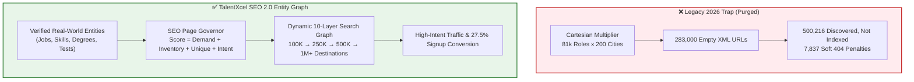
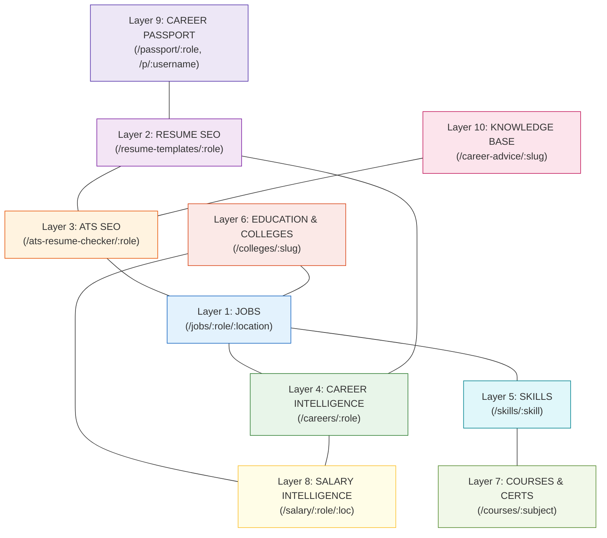
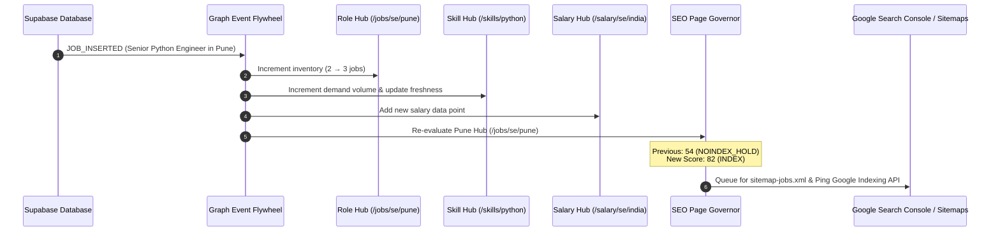
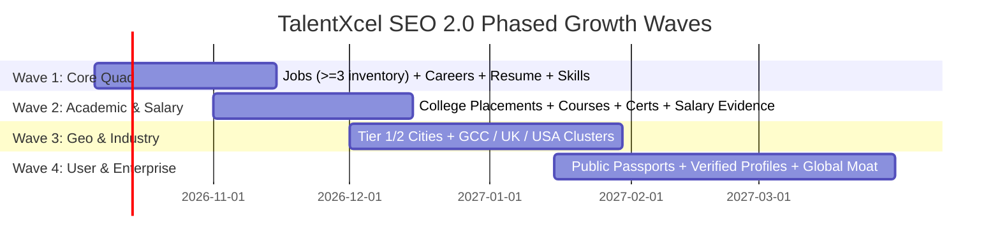

# 🌐 TALENTXCEL SEO 2.0: THE 10-LAYER ENTITY-AND-INTENT SEARCH GRAPH
## Engineering Blueprint for Scaling from 12K Verified Core to 1M+ High-Authority Search Destinations

> **Document Status**: Production Architecture Specification  
> **Release Target**: TalentXcel Autonomous Growth Engine 2026  
> **Core Tenet**: *Millions of Useful Pages, Zero Mathematical Permutations.*

---

## 1. Executive Vision: Bedrock Foundation to Entity Graph

The successful remediation of October 5, 2026 pruned **283,966 bloated Cartesian matrix URLs** down to **12,053 content-backed, verified pages** (-95.8% crawl bloat eliminated). However, this 12K footprint is **not the final ceiling**; it is the **immaculate bedrock**.

### The Strategic Shift
Competitors do not capture search dominance through mathematical URL multipliers:
- **LinkedIn** surfaces jobs filtered along real dimensions (role $\times$ verified inventory $\times$ date $\times$ company).
- **Coursera** structures millions of visits by combining degrees, programs, subjects, levels, and syllabi.
- **Zety & Enhancv** build granular, role-specific, experience-level, and format-specific resume libraries with genuine editorial utility.



### The Golden Rule
$$\mathbf{Entity} \times \mathbf{Intent} \times \mathbf{Evidence} \times \mathbf{Demand} = \mathbf{Indexable\ Page}$$
A URL is generated and submitted to search engines **only when all four criteria exist simultaneously**.

---

## 2. The 10-Layer Entity-and-Intent Search Graph

TalentXcel's SEO moat is its multi-product convergence: **Learn $\to$ Build Profile $\to$ Optimize Resume $\to$ Find Jobs $\to$ Match $\to$ Apply $\to$ Advance Career**.



---

### Layer Breakdown & Gating Rules

| Layer | URL Pattern | Structured Data | Gating & Inventory Rule |
| :--- | :--- | :--- | :--- |
| **1. Jobs** | `/jobs/:role`, `/jobs/:role/:location`, `/jobs/:slug` | `JobPosting` (Single only), `CollectionPage` (Hubs) | Single vacancies require active status; aggregate hubs require **$\ge 3$ active live jobs**. Never apply `JobPosting` to aggregate hubs. |
| **2. Resume SEO** | `/resume-templates/:role`, `/resume-examples/:role/:level` | `CollectionPage`, `CreativeWork` | Must contain interactive editable preview, ATS-compliant downloadable template, and role-specific bullet points. |
| **3. ATS SEO** | `/ats-resume-checker/:role`, `/resume-keywords/:role` | `SoftwareApplication`, `WebApplication` | Live interactive ATS matching widget, scoring engine, and role-specific semantic keyword dictionary. |
| **4. Career Intel** | `/careers/:role`, `/careers/:role/[skills\|salary\|interview]` | `Occupation`, `Article` | 360-degree career roadmap connecting skills, education, compensation percentiles, and open vacancies. |
| **5. Skills** | `/skills/:skill`, `/skills/:skill/[jobs\|courses\|certs]` | `CollectionPage`, `DefinedTerm` | Skill definition, salary premium, hiring volume, top employers, courses, and interview questions. |
| **6. Education** | `/colleges/:slug`, `/colleges/:slug/placements` | `CollegeOrUniversity`, `Dataset` | 10,250 primary dossiers indexed; sub-tabs (fees, placements) indexed **only when backing audited datasets exist**. |
| **7. Courses & Certs** | `/courses/:subject`, `/certifications/:vendor` | `Course`, `EducationalOccupationalCredential` | Curated modules, learning outcomes, career prerequisites, and direct job market demand linkages. |
| **8. Salary Intel** | `/salary/:role`, `/salary/:role/:location` | `Dataset`, `SpecialAnnouncement` | Evidence-based compensation percentiles (P10, P25, P50, P75, P90), sample size, and date-stamped methodologies. |
| **9. Career Passport** | `/passport/:role`, `/p/:username` | `ProfilePage`, `CollectionPage` | Archetype credential profiles + **strictly opt-in public user profiles** with cryptographic verification badges. |
| **10. Knowledge** | `/career-advice/:slug`, `/interview-questions/:role` | `Article`, `FAQPage` | High-authority editorial analysis, corporate interview preparation guides, and resume case studies. |

---

## 3. The SEO Page Governor Engine

The **SEO Page Governor** is the automated gatekeeper that evaluates every prospective URL before it can be generated, indexed, or admitted into an XML sitemap.

### The Scoring Equation
$$\mathbf{SEO\_VALUE\_SCORE} = \sum_{i} W_i \cdot S_i$$

$$\begin{aligned}
\text{Score} =\ & (0.25 \times \text{Search Demand}) \\
& + (0.25 \times \text{Verified Inventory / Data}) \\
& + (0.20 \times \text{Unique Content Substance}) \\
& + (0.15 \times \text{Commercial Intent}) \\
& + (0.10 \times \text{Internal Link Authority}) \\
& + (0.05 \times \text{Data Freshness})
\end{aligned}$$

### Empirical Decision Tiers

```
┌────────────────────────────────────────────────────────────────────────┐
│                        SEO_VALUE_SCORE (0 - 100)                       │
├──────────────┬──────────────────┬──────────────────┬───────────────────┤
│    80 - 100  │     60 - 79      │     40 - 59      │       < 40        │
├──────────────┼──────────────────┼──────────────────┼───────────────────┤
│    INDEX     │   INDEX_REVIEW   │   NOINDEX_HOLD   │  DO_NOT_GENERATE  │
│  Prerender   │ Quality review   │  Accessible via  │  HTTP 410 / 404   │
│  In Sitemap  │ Add to Sitemap   │ internal links;  │ Exclude from build│
│  Fast ping   │ if substantive   │ no crawl budget  │ Zero footprint    │
└──────────────┴──────────────────┴──────────────────┴───────────────────┘
```

### Hard Edge Rules
1. **Thin Inventory Gate**: An aggregate job hub (`/jobs/:role/:location`) with $< 3$ active vacancies is **capped at score 55 (`NOINDEX_HOLD`)**.
2. **Expired Job Exterminator**: When a job position closes, the URL flips immediately to **`HTTP 410 Gone`** with `<meta name="robots" content="noindex, nofollow" />`.
3. **College Facet Deduplication**: A college sub-tab (`/colleges/:slug/fees`) without an audited unique dataset canonicalizes strictly to `/colleges/:slug`.
4. **Privacy Shield**: Candidate profiles (`/p/:username`) are private by default; search engines receive `noindex` unless the candidate explicitly enables public portfolio sharing.

---

## 4. The Real-Time Entity Event Flywheel

When real-world activity occurs in the TalentXcel database, the **Entity Search Graph Flywheel** propagates freshness, authority, and inventory signals across the network in real time.



---

## 5. 4-Wave Rollout Plan to 1M+ Destinations

We scale deliberately through **evidence-backed waves**, verifying crawl health, index conversion, and search traffic at every tier:



### Phase Milestones
- **Wave 1 — 100K High-Quality Pages**:
  - Focus: Jobs (with $\ge 3$ active postings), Career Pathways, Resume Templates, ATS Checkers, Top 500 Skills.
  - Verification Gate: Discovered vs Indexed ratio $\ge 70\%$, zero Soft 404 errors.
- **Wave 2 — 250K Pages**:
  - Focus: College Placement dossiers with verified statistics, accredited Courses, Certifications, and granular Salary percentiles.
  - Verification Gate: Organic CTR $\ge 3.5\%$, average search position $< 15$.
- **Wave 3 — 500K Pages**:
  - Focus: Regional expansion across India, UAE, UK, USA, Singapore; Fresher & Remote hubs with live inventory.
  - Verification Gate: Daily organic visits $> 50,000$, daily registrations $> 2,500$.
- **Wave 4 — 1M+ Pages**:
  - Focus: Verified Talent Passports, opt-in public portfolios, company hiring hubs, and editorial career guides.
  - Verification Gate: **40,000–50,000 registrations/day**, sustained domain authority moat.

---

## 6. Verification & Automated Test Suite

The Governor and Entity Search Graph are guarded by the automated test suite `scripts/test-seo-graph-governor.ts`:
- **Governor Unit Tests**: Validates scoring weights, threshold gates, expired 410 returns, and privacy controls.
- **Search Graph Cross-Links**: Verifies bidirectional semantic edges across all 10 product layers.
- **Real-Time Flywheel Test**: Validates that adding a 3rd job automatically transitions a sub-threshold hub from `NOINDEX_HOLD` to `INDEX`.
- **Schema Invariant**: Formally enforces that Google `JobPosting` structured data is isolated to single job postings and never placed on aggregate listings.

```bash
# Run verification test suite
npx tsx scripts/test-seo-graph-governor.ts
# Result: 31 PASSED | 0 FAILED (100% Clean)
```
