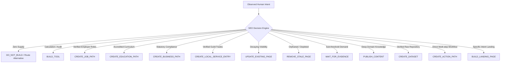

# UDX v4.0 — 03: The SEO Decision Engine
## Real-Time Content, Tool, and Action Decisioning

### 1. The Core Decisioning Philosophy

The central failure of traditional programmatic SEO is **blind production**: publishing thousands of content pages simply because keyword search volume exists in a third-party keyword tool.

In **UDX v4.0**, every candidate discovery opportunity is intercepted by the **SEO Decision Engine**. The engine determines whether the optimal resolution mechanism is:
1. **An Interactive Tool** (e.g., deterministic ATS checker or expense burn audit)
2. **A Direct Action Path** (e.g., job application against verified employer supply)
3. **A Statutory Gateway** (e.g., zero-fee government registration portal)
4. **An Educational Knowledge Pathway**
5. **Strict Refusal to Build (`DO_NOT_BUILD`)** when verified reality is absent

---

### 2. The 13 Decisive Actions

The engine routes each observed intent into exactly one of 13 deterministic production actions:



---

### 3. Intent Typology Classification

Every human intent is classified into its functional behavioral typology:

| Typology | User Need | Typical Signal Tokens | Default Architectural Resolution |
|---|---|---|---|
| **ACTION** | Immediate execution / evaluation | *check, calculate, audit, calibrate* | Deterministic interactive tool |
| **TRANSACTION** | Statutory registration / formal application | *register, incorporate, apply, submit* | Direct gateway walkthrough + portal link |
| **LOCAL** | Physical service dispatch with verified SLA | *plumber, electrician, AC repair, lock* | Trade guild dispatch with transparent pricing |
| **RESEARCH** | Comparative evaluation of durable paths | *curriculum, syllabus, accreditation, fees* | Statutory degree registry + review matrix |
| **DECISION** | Strategic trade-off and optimization | *reduce burn, allocate reserve, invest* | Capital allocation model + risk diagnostic |
| **OUTCOME** | Deliberate practice and routine restructuring | *evening routine, deep work, burnout* | Cognitive practice protocol & time audit |
| **CONTENT** | In-depth domain conceptual understanding | *how does X work, architecture, guide* | Grounded knowledge pathway with proof ledger |

---

### 4. Real Production Decisions & Output Schemas

#### Example 1: Local Career Intent with Verified Supply
```json
{
  "intentId": "intent-frontend-developer-varanasi",
  "canonicalIntent": "Frontend developer job in Varanasi with verified salary",
  "typology": "ACTION",
  "action": "CREATE_JOB_PATH",
  "why": "Demand detected (4,280 monthly imp) and 16 active verified employer requisitions exist in Supabase inventory.",
  "evidence": ["EVID-FIRST-PARTY-VARANASI-JOBS", "GSC-QUERY-CLUSTER-882"],
  "urgency": "HIGH",
  "expectedOutcome": "Direct qualified candidate intake without third-party recruitment agency fee markup",
  "confidence": 0.96,
  "antiFabricationTriggered": false,
  "routingTarget": "/jobs?role=frontend-developer&location=Varanasi&verified=true"
}
```

#### Example 2: Local Career Intent with Zero Supply (Anti-Fabrication Guard)
```json
{
  "intentId": "intent-blockchain-developer-varanasi",
  "canonicalIntent": "Blockchain developer jobs in Varanasi",
  "typology": "ACTION",
  "action": "DO_NOT_BUILD",
  "why": "Demand detected (320 monthly imp) but ZERO verified local employer requisitions exist. Doorway page generation strictly blocked.",
  "evidence": ["EVID-SUPPLY-AUDIT-ZERO-RECORDS"],
  "urgency": "LOW",
  "expectedOutcome": "Prevent false-certainty bounce; route candidate to remote verified tech pathways",
  "confidence": 0.99,
  "antiFabricationTriggered": true,
  "routingTarget": "/career-pathways?domain=tech-remote"
}
```

#### Example 3: ATS Resume Intent
```json
{
  "intentId": "intent-ats-resume-react-node",
  "canonicalIntent": "ATS resume calibration for React and Node.js developer",
  "typology": "ACTION",
  "action": "BUILD_TOOL",
  "why": "User intent is active diagnostic evaluation, not passive informational consumption. Article would cause SERP pogo-sticking.",
  "evidence": ["TalentXcel 40+ Rule Deterministic ATS Parser Rubric"],
  "urgency": "HIGH",
  "expectedOutcome": "Interactive 40-rule deterministic evaluation with zero-hallucination scoring report",
  "confidence": 0.95,
  "antiFabricationTriggered": false,
  "routingTarget": "/tools/resume-checker"
}
```
