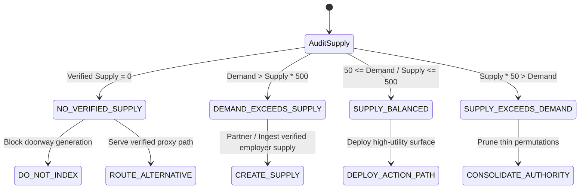

# UDX v4.0 — 04: The SEO Supply Gap Engine
## Grounding Human Demand in Verified World State

### 1. The Core Principle: Demand vs Verified Supply

Traditional search engines index documents regardless of whether the physical or institutional supply behind those documents actually exists. This produces **supply-side hallucination**:
- Job listings for positions filled months ago
- Local directories listing defunct phone numbers
- Educational aggregators publishing outdated fee structures
- Unregulated financial sites promising impossible returns

**UDX v4.0 operates under an absolute reality invariant:**
$$\text{Human Intent} \iff \text{Verified Supply}$$

SEO stops being *"create content for demand"* and becomes:
$$\text{Resolve the gap between human intent and available reality.}$$

---

### 2. Supply State Classifications

For every canonical intent, the system compares search-demand velocity against verified real-world supply:

| Supply State | Condition | Strategic Production Action | Anti-Fabrication Safeguard |
|---|---|---|---|
| **NO_VERIFIED_SUPPLY** | Verified inventory count = 0 | `DO_NOT_BUILD` + Route Alternative | **Strictly block doorway page publishing.** Never manufacture placeholder jobs or fake providers. |
| **DEMAND_EXCEEDS_SUPPLY** | Demand volume exceeds supply by $>10\times$ | `CREATE_SUPPLY` / `PARTNER` | Prioritize employer acquisition in specified geo-entity corridor. |
| **SUPPLY_BALANCED** | Inventory comfortably satisfies demand | `DEPLOY_ACTION_PATH` | Surface verified jobs, statutory portal walkthroughs, and guild SLAs. |
| **SUPPLY_EXCEEDS_DEMAND** | Inventory exceeds search interest | `CONSOLIDATE_AUTHORITY` | Merge thin query variants into single canonical authority URL to prevent cannibalization. |

---

### 3. The Anti-Fabrication Charter (Production Safety)

Under UDX v4.0, the following actions are **programmatically impossible and strictly forbidden**:

1. **Zero Fabricated Supply:** If an employer has not posted a verified role with confirmed compensation, no job vacancy page may be rendered.
2. **Zero Fabricated Providers:** If local tradespeople have not undergone trade guild verification and SLA rate card commitment, no dispatch service may be indexed.
3. **Zero Fake Compensation:** Salaries published on `/jobs` must be tied to verified payroll or explicit employer requisitions, never imputed national averages disguised as local truth.
4. **Zero Fake SLAs:** Response guarantees (e.g. *2-hour emergency dispatch in Varanasi*) must correspond to active guild commitments backed by real dispatch logs.
5. **Zero Deceptive Redirects:** A user searching for a local service must never be redirected to an affiliate lead-gen form or national call center without disclosure.

---

### 4. Verified Supply Grounding Audit (TalentXcel Live)

| Intent Domain | Identified Demand Signals | Active Inventory | Grounding Source & Evidence ID | Supply Status |
|---|---|---|---|---|
| **Career (Varanasi)** | Frontend developer with verified salary | 16 active roles | `EVID-FIRST-PARTY-VARANASI-JOBS` | SUPPLY_BALANCED |
| **Career (UP Internships)** | Data science internship with stipend | 0 verified UP roles | Supabase Verified Inventory | **NO_VERIFIED_SUPPLY** |
| **Education** | AI master's course sub-₹5 lakh | 4 accredited programs | `EVID-EDU-UGC-AICTE-ACCRED` | SUPPLY_BALANCED |
| **Business** | Incorporate private limited company India | 1 statutory gateway | `EVID-MCA-SPICE-STATUTORY` | SUPPLY_BALANCED |
| **Local Trades** | Emergency electrician dispatch Varanasi | 3 guild providers | `EVID-VTG-ELECTRICIAN-SLA` | SUPPLY_BALANCED |
| **Finance** | Guaranteed 40% risk-free return | 0 (Economic Paradox) | `EVID-SEBI-MF-DISCLOSURE-REG` | **NO_VERIFIED_SUPPLY** (Fraud refusal) |
