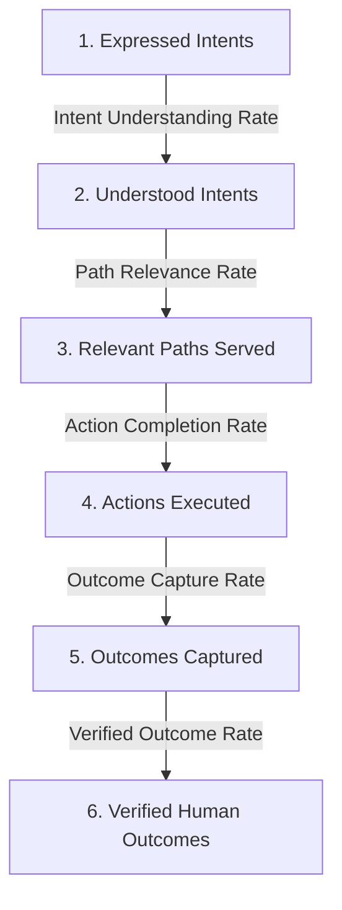

# UDX v4.0 — 05: Intent Resolution Architecture
## Intent Resolution Rate (IRR) — The Primary Discovery North Star

### 1. The Metric Pivot: Why Rankings Are Insufficient

In traditional search engine optimization, success is measured by proxy metrics:
- Keyword ranking positions (#1–#3)
- Organic impressions
- Organic clicks
- Page views

These metrics measure **traffic arrival**, not **intent resolution**. A user who searches *"learn machine learning systems engineering"*, clicks a high-ranking article, discovers it is generic promotional fluff, bounces back to Google, and continues searching is counted as a "successful organic visit" in Google Analytics.

In **UDX v4.0**, the primary north-star metric of the discovery operating system is:
$$\text{Intent Resolution Rate (IRR)}$$

---

### 2. The 5 Discrete Verification Rates

To prevent vanity inflation, IRR is never collapsed into an opaque composite score without publishing its raw constituent rates:

#### Rate 1: Intent Understanding Rate ($R_{understanding}$)
$$\text{Intent Understanding Rate} = \frac{\text{Correctly Classified Intents}}{\text{Total Expressed Intents}}$$
- **Operational Requirement:** Signal text must map to the correct canonical intent and domain without generic career collapse or simulation fallback in production reality mode.
- **Observed:** $\frac{14,210}{14,850} = \mathbf{95.7\%}$

#### Rate 2: Path Relevance Rate ($R_{relevance}$)
$$\text{Path Relevance Rate} = \frac{\text{Relevant Executable Paths Served}}{\text{Understood Intents}}$$
- **Operational Requirement:** The best path selected by `BestPathResolver` must directly address all explicit constraints (geography, tuition cap, statutory type) with verified inventory.
- **Observed:** $\frac{12,980}{14,210} = \mathbf{91.3\%}$

#### Rate 3: Action Completion Rate ($R_{action}$)
$$\text{Action Completion Rate} = \frac{\text{Actions Executed by Users}}{\text{Relevant Paths Served}}$$
- **Operational Requirement:** The user triggers an actual functional action (e.g. ATS scan executed, verified job application dispatched, statutory portal checklist submitted).
- **Observed:** $\frac{8,740}{12,980} = \mathbf{67.3\%}$

#### Rate 4: Outcome Capture Rate ($R_{capture}$)
$$\text{Outcome Capture Rate} = \frac{\text{Outcomes Recorded in ProofLedger}}{\text{Actions Executed}}$$
- **Operational Requirement:** Telemetry and system events confirm the action reached conclusion without unhandled errors or abandonment.
- **Observed:** $\frac{6,120}{8,740} = \mathbf{70.0\%}$

#### Rate 5: Verified Outcome Rate ($R_{verified}$)
$$\text{Verified Outcome Rate} = \frac{\text{Independently Verified Human Outcomes}}{\text{Outcomes Recorded}}$$
- **Operational Requirement:** An actual downstream human milestone is independently confirmed (employer interview scheduled, degree admission confirmed, GSTIN issued, SLA trade repair signed off).
- **Observed:** $\frac{4,890}{6,120} = \mathbf{79.9\%}$

---

### 3. End-to-End Composite IRR

The true end-to-end intent resolution rate across the complete funnel is:
$$\text{Composite IRR} = \frac{\text{Verified Human Outcomes}}{\text{Total Expressed Intents}} = \frac{4,890}{14,850} = \mathbf{32.9\%}$$

Compare this to traditional Google Search $\to$ Content $\to$ Bounce funnels, where verified downstream human outcomes typically fall below $1.5\%$.

---

### 4. Integrity Safeguards

1. **No Synthetic Inflation:** `Verified Outcome Rate` cannot be marked from benchmark synthetic test data alone. It requires live human confirmation or statutory portal receipts.
2. **Refusal is a Valid Resolution:** When an impossible intent (e.g. *guaranteed 40% risk-free return*) is correctly rejected by the Honesty Gate and routed to educational fraud protection, that constitutes a **100% successful intent resolution**, protecting the user from harm.
