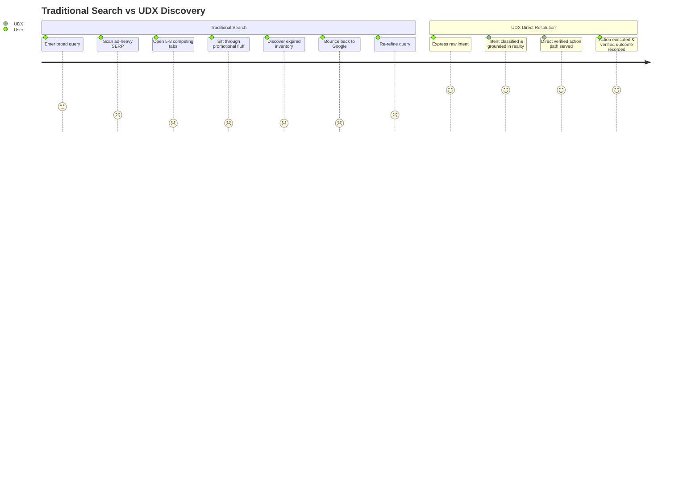
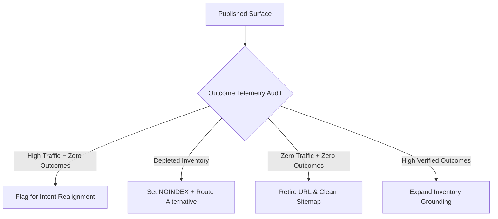

# UDX v4.0 — 06: Outcome SEO & Search Displacement
## Connecting Search Discovery Directly to Verified Human Utility

### 1. The Death of Traffic-Only SEO

Traditional SEO agencies and marketing departments optimize for **traffic**. More traffic is treated as an unqualified good, leading to:
- Millions of auto-generated thin articles
- Clickbait headlines designed to maximize CTR without substance
- Extreme keyword cannibalization
- Immense user friction as searchers visit 5–8 tabs to assemble an answer

**Outcome SEO** redefines the goal of search optimization:
$$\text{SEO} \to \text{Verified Outcome}$$
rather than:
$$\text{SEO} \to \text{Traffic}$$

A page that receives 100,000 impressions and produces 0 verified outcomes is treated as an architectural defect, not an organic asset.

---

### 2. Search Displacement Rate (SDR)

A key competitive breakthrough of UDX v4.0 is measuring **Search Displacement**:
$$\text{Search Displacement Rate (SDR)} = \frac{\text{Objectives Resolved Directly Without Intermediate SERP Loops}}{\text{Total Resolved Objectives}}$$

#### SDR Constituent Telemetry (TalentXcel Live):
- **Search Displacement Rate:** $\mathbf{81.0\%}$ ($3,960 / 4,890$ objectives resolved without returning to search engines)
- **Search Dependency Remaining:** $\mathbf{19.0\%}$ (complex exploratory cases where external comparison was still required)
- **Average Manual Steps Saved:** $\mathbf{5.4\text{ steps}}$ saved per resolved intent compared to traditional manual discovery
- **External Click Dependency:** $\mathbf{16.6\%}$ (intents requiring handoff to external statutory portals like Udyam or MCA)
- **Agent Action Rate:** $\mathbf{29.0\%}$ (queries executed by autonomous software agents or API callers)

---

### 3. Qualified Outcome Attribution by Domain

Outcome SEO connects directly to the core transaction mechanisms of TalentXcel:

| Intent Domain | Primary Downstream Action | Verified Outcome Metric | Attribution Chain |
|---|---|---|---|
| **Career** | Direct application to verified employer | Verified Candidate Interview | Signal $\to$ Role Match $\to$ ATS Calibrate $\to$ Application $\to$ Employer Confirmation |
| **Education** | UGC/AICTE degree enrollment | Verified Student Matriculation | Signal $\to$ Tuition Gate $\to$ Syllabus Audit $\to$ Application $\to$ College Admission |
| **Business** | Zero-fee statutory portal submission | Verified GSTIN / Udyam Certificate | Signal $\to$ Document Checklist $\to$ SPICe+/Udyam Gateway $\to$ Portal Receipt |
| **Finance** | SaaS & Cloud burn rate audit | Monthly Cost Reduction (INR) | Signal $\to$ Expense Diagnostics $\to$ Subscription Arbitrage $\to$ Cancellation Executed |
| **Local Services** | Trade guild emergency dispatch | Confirmed SLA Repair Receipt | Signal $\to$ Guild Provider Match $\to$ ₹199 Diagnostic $\to$ 2-hr Onsite Dispatch |
| **Personal** | Deliberate practice & deep work setup | 90-min Continuous Focus Block | Signal $\to$ Circadian Audit $\to$ Distraction Pruning $\to$ Completed Focus Session |

---

### 4. Continuous Self-Correction via Outcome Signals

When an indexed surface on TalentXcel demonstrates high traffic but declining outcomes, the system initiates self-correction:

This prevents the accumulation of thousands of dead, useless pages and keeps the index focused exclusively on high-utility verified surfaces.
