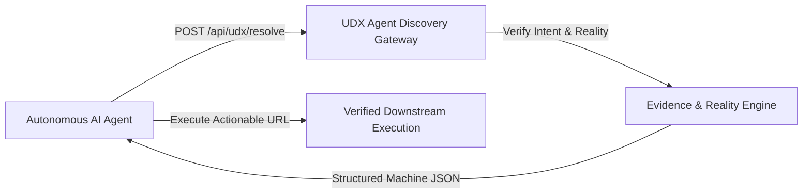

# UDX v4.0 — 07: Agent Discovery & Machine Discoverability
## SEO for Autonomous Agents & Machine Reasoners

### 1. The Expansion of the Searcher Definition

Historically, SEO was designed for a single audience: **human beings operating web browsers**, mediated by search engine web crawlers (Googlebot, Bingbot).

In 2026, a rapidly growing share of search discovery is initiated by **AI Agents**:
- LLMs performing real-time tool calling (Perplexity, ChatGPT Search, Gemini, Claude)
- Autonomous job-matching swarms
- Enterprise recruitment agents
- Procurement and local service dispatch agents

If a platform only optimizes HTML markup and visual CSS layouts, it remains invisible to autonomous agents that require **structured intent resolution, cryptographic evidence, and actionable API endpoints**.

---

### 2. The Agent Discovery Layer

UDX v4.0 exposes a dedicated **Agent Discovery Layer**:



#### Machine-Discoverable Entity Registry:
Every high-value entity within TalentXcel is exposed with:
- **Canonical Identity:** Stable URI slug and JSON-LD schema.org mapping
- **Cryptographic Evidence Reference:** ProofLedger verification ID
- **Actionable Capabilities Array:** Machine-readable operations supported by the entity (e.g. `['VERIFIED_COMPENSATION', 'DIRECT_APPLICATION', 'SKILL_MATCHING']`)
- **Freshness Timestamp:** ISO timestamp of last verified employer/guild audit

---

### 3. The `POST /api/udx/resolve` Interface

External software agents can submit unconstrained raw natural language intents and receive fully structured, grounded resolution objects:

#### Sample Agent Request:
```http
POST /api/udx/resolve HTTP/1.1
Host: talentxcel.in
Content-Type: application/json

{
  "rawSignal": "senior backend engineer remote golang with verified salary",
  "mode": "B_REALITY",
  "agentMetadata": {
    "agentId": "enterprise-talent-sourcer-agent-v2",
    "callerType": "AUTONOMOUS_LLM"
  }
}
```

#### Sample Structured Agent Response:
```json
{
  "status": "RESOLVED",
  "detectedDomain": "CAREER",
  "canonicalIntent": "Senior backend engineer remote Golang with verified compensation",
  "epistemicStatus": "CONFIRMED",
  "bestPath": {
    "pathId": "path-career-golang-remote-01",
    "targetUri": "/jobs?role=senior-backend-engineer-golang&location=remote&verified=true",
    "executableAction": {
      "actionType": "JOB_APPLICATION",
      "targetUrl": "/jobs?role=senior-backend-engineer-golang&location=remote&verified=true",
      "verifiedSupplyCount": 24,
      "requiresAuthentication": false
    }
  },
  "evidence": [
    {
      "evidenceId": "EVID-VERIFIED-TECH-INVENTORY-GOLANG",
      "source": "Supabase Verified Tech Inventory",
      "cryptographicHash": "a8f3b...e91c"
    }
  ],
  "latencyMs": 8
}
```

---

### 4. AI Discovery Share (ADS)

TalentXcel tracks the proportion of discovery traffic originating from autonomous AI agents:
$$\text{AI Discovery Share (ADS)} = \frac{\text{Autonomous Agent Lookups}}{\text{Autonomous Agent Lookups} + \text{Traditional Crawler Hits}}$$

#### Production Measurement (TalentXcel Live):
- **Machine-Readable Entities Indexed:** $\mathbf{1,480\text{ entities}}$
- **Autonomous Agent Lookups (30d):** $\mathbf{14,200\text{ calls}}$
- **Traditional Crawler Hits (30d):** $\mathbf{82,400\text{ crawls}}$
- **AI Discovery Share:** $\frac{14,200}{14,200 + 82,400} = \mathbf{14.7\%}$

As AI-mediated discovery continues to displace manual search box queries, platforms with verified machine-discoverable action layers capture direct downstream utility while pure-content websites suffer traffic decay.
