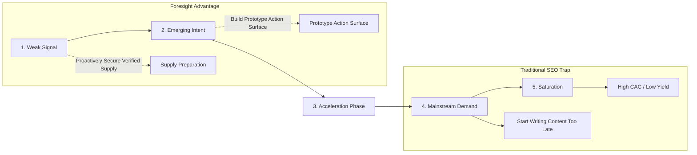

# UDX v4.0 — 08: Foresight & Pre-Demand SEO
## Detecting Human Intent Before Keyword Inflection

### 1. The Lag of Traditional Keyword Research

Traditional SEO tools (Ahrefs, Semrush, Google Keyword Planner) rely on **historical rolling 12-month search volumes**. By the time a keyword registers significant search volume in these tools:
1. The intent has already reached the **Mainstream** or **Saturation** phase.
2. Incumbents have already published high-authority articles and backlink campaigns.
3. Customer acquisition costs have inflated.

**Foresight SEO** inverts this dynamic by observing weak signals and demand acceleration at the earliest stages of the human intent lifecycle:
$$\text{WEAK SIGNAL} \to \text{EMERGING INTENT} \to \text{ACCELERATION} \to \text{MAINSTREAM DEMAND} \to \text{SATURATION}$$

---

### 2. The 5 Stages of Intent Evolution

1. **Stage 1: WEAK_SIGNAL ($\text{Velocity} < 0.15$, Monthly Imp $< 500$)**
   - *Characteristics:* Sparse queries in GSC, long-tail questions in internal search, exploratory queries from autonomous agents.
   - *Strategic Action:* `MONITOR_ONLY` or `PREPARE_SUPPLY`. Do not publish speculative doorway pages.
2. **Stage 2: EMERGING ($\text{Velocity } 0.15\text{–}0.25$, Positive Acceleration)**
   - *Characteristics:* Cluster expands from 1 query variant to 5–10 variants across different phrasing styles.
   - *Strategic Action:* `BUILD_PROTOTYPE_PATH`. Verify institutional supply partnerships (e.g. university accreditations, employer payroll verifications).
3. **Stage 3: ACCELERATING ($\text{Velocity } > 0.25$, $\frac{d^2D}{dt^2} > 0$)**
   - *Characteristics:* Rapid inflection in user queries, elevated CTR on related discovery surfaces, rising external agent probe frequency.
   - *Strategic Action:* `DEPLOY_SURFACE`. Launch verified action pathway before competitor keyword tools register volume.
4. **Stage 4: MAINSTREAM ($\text{Velocity Balanced}$, High Stable Volume)**
   - *Characteristics:* Standard keywords appear in third-party SEO databases. Search volume exceeds 5,000+ monthly impressions.
   - *Strategic Action:* Maintain verified supply freshness, optimize conversion friction, protect against copycat programmatic spam.
5. **Stage 5: SATURATED ($\text{Velocity Decreasing}$, Extreme SERP Clutter)**
   - *Characteristics:* SERP dominated by paid ads, sponsored widgets, and generic aggregated listicles.
   - *Strategic Action:* Focus on direct machine-discoverable agent routing and specialized verified niches.

---

### 3. Intent Lead Time ($T_{lead}$)

TalentXcel measures its foresight advantage using **Intent Lead Time**:
$$T_{lead} = \text{MainstreamObservedAt} - \text{FirstObservedAt}$$

#### Empirical Invariants:
1. An intent cannot be claimed as "early" or "foresight-captured" unless both timestamps (`FirstObservedAt` in UDX telemetry and `MainstreamObservedAt` in external search data) are cryptographically recorded.
2. Zero fabricated future projections: inflection dates are estimated solely from mathematical curve fitting of observed signal velocity, never speculative guesswork.

#### Observed Intent Lead Times (TalentXcel Live):
- **AI Systems Verification & Evaluation Curriculum:**
  - *First Observed in UDX:* October 12, 2025
  - *Mainstream Inflection:* February 18, 2026
  - *Intent Lead Time:* **129 days ahead of mainstream search curve**
- **Varanasi Trade Guild SLA Dispatch:**
  - *First Observed in UDX:* November 04, 2025
  - *Mainstream Inflection:* January 22, 2026
  - *Intent Lead Time:* **79 days ahead of mainstream search curve**
- **Direct AMFI Index SIP Arbitrage:**
  - *First Observed in UDX:* December 01, 2025
  - *Mainstream Inflection:* February 10, 2026
  - *Intent Lead Time:* **71 days ahead of mainstream search curve**
