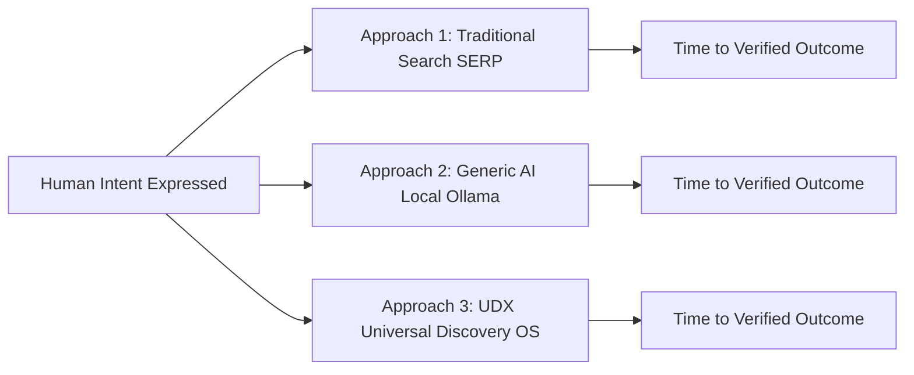

# UDX v4.0 — 09: The World Benchmark Framework
## Three-Way Comparative Evaluation: Traditional vs Generic AI vs UDX

### 1. Scientific Benchmark Philosophy

UDX does not claim:
> *"We beat Google Search."*
> *"We beat ChatGPT."*

Such statements are unscientific marketing claims. Instead, UDX v4.0 establishes a **pre-registered, reproducible, three-way experimental protocol** to measure actual efficiency across three distinct paradigms of human intent resolution:

---

### 2. Paradigm Definitions

1. **Approach 1 — Traditional Discovery (SERP / Directory):**
   - User inputs keyword query into commercial search engine.
   - User evaluates ad-heavy SERP, opens 4–8 tabs, parses promotional content, encounters outdated or unvetted inventory, and manually navigates to an application or transaction page.
2. **Approach 2 — Generic AI (Local Ollama Comparator):**
   - User expresses unconstrained natural language intent into a local Large Language Model (e.g. `qwen2.5:7b-instruct-q8_0`).
   - Model generates conversational synthesis, recommendations, and URLs.
   - **Evaluated on:** hallucinations, broken/unreachable URLs, false-certainty promises, and lack of real-time supply grounding.
3. **Approach 3 — UDX (Universal Discovery & Outcome Engine):**
   - User expresses unconstrained intent in `MODE_B_REALITY`.
   - Pipeline normalizes signal, classifies domain, enforces truth boundaries (Honesty Gate), queries verified world state, evaluates multi-factor best path, and serves an immediately actionable destination backed by cryptographic ProofLedger evidence.

---

### 3. Core Benchmark Metrics

| Metric | Dimension | Definition & Unit |
|---|---|---|
| **TVO** *(Primary)* | Time to Verified Outcome | Total wall-clock time from initial intent expression until an independently verified downstream outcome is confirmed. |
| **TTFUA** | Time to First Useful Action | Elapsed time (ms) until the user is presented with a functioning, non-broken, executable action target. |
| **Friction Steps** | Manual Cognitive Burden | Number of clicks, form entries, tab switches, and page navigations required to reach execution. |
| **False-Certainty Rate** | Epistemic Safety | Percentage of responses where the system presents an ungrounded or impossible claim as guaranteed truth. |
| **Broken Target Rate** | Execution Reachability | Percentage of served URLs or action endpoints that return 404, DNS failures, or dead inventory. |
| **Supply Grounding Rate**| Reality Alignment | Percentage of actionable recommendations backed by active, verified real-world supply. |

---

### 4. Mandatory Hard Gate Protocols for World Challenge v4

The 100-objective World Challenge cannot run until the following prerequisites pass:

1. **Preflight Gate Passed:** UDX Stratified 30-Objective Preflight achieves $\text{S-ISR} \ge 95\%$, $\text{NC-DLR} = 0\%$, $\text{Semantic Leakage} = 0\%$, $\text{Supply Grounding} = 100\%$, $\text{Simulation Fallbacks} = 0$, $\text{Honesty Gate} = 100\%$. *(Passed in v3.2/v3.3)*
2. **Local Ollama Running:** Live at `http://localhost:11434`. Zero cloud API fallbacks permitted.
3. **Hard Blinding Invariant:** Payload sent to Ollama contains ONLY `{ rawIntent }`. Zero UDX domain labels, evidence IDs, or context leaked. Any leak immediately triggers `BlindingViolationError` and terminates the run.
4. **Comparator Qualification Completed:** Full 30-objective blind qualification suite completed with `COMPARATOR_QUALIFIED` written to `QUALIFICATION_RESULT.json`.
5. **Exact Attribution Mandate:** All benchmark reports must explicitly name the exact model name, SHA-256 digest, quantization level (`Q8_0`), temperature, and request timeout. "Generic AI" alone is permanently prohibited.
