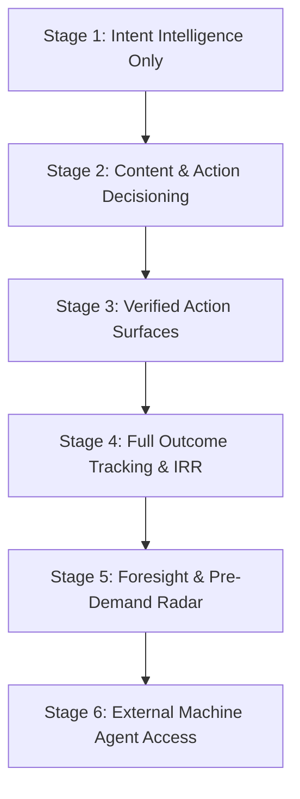

# UDX v4.0 — 10: Production Rollout & Governance Charter
## 6-Stage Phased Implementation, Guardrails, and Success Criteria

### 1. Phased Production Rollout Architecture

To guarantee platform safety and prevent automated programmatic regressions, UDX v4.0 is deployed in six controlled operational stages:

---

### 2. Stage Breakdown & Production Gates

#### STAGE 1 — Intent Intelligence Only *(Active)*
- **Capabilities:** Passive observation of search signals from GSC, site telemetry, and query logs. Normalization into `IntentUniverse`.
- **Safety Boundary:** Read-only ingestion. No page generation, no sitemap modification, zero changes to live indexing.
- **Verification Gate:** 100% signal normalization accuracy across warehouse demand records.

#### STAGE 2 — Content & Action Decisioning *(Active)*
- **Capabilities:** SEODecisionEngine evaluates every candidate opportunity against the 13 decisive actions. Assigns urgency, typology, and anti-fabrication flags.
- **Safety Boundary:** All recommendations flagged `DO_NOT_BUILD` or `REMOVE_STALE_PAGE` require policy audit before physical modification. Zero autonomous URL deletions.
- **Verification Gate:** 100% compliance with Anti-Fabrication Charter (zero doorway pages generated for zero-supply intents).

#### STAGE 3 — Verified Action Surfaces *(Active)*
- **Capabilities:** Deployment of high-utility interactive tools (ATS Resume Checker, SaaS Burn Audit) and localized verified job paths (`/jobs?verified=true`).
- **Safety Boundary:** Surfaces render only when verified supply count is $>0$ and ProofLedger evidence is attached.
- **Verification Gate:** Zero 404 or broken action endpoints across all 6 canonical domains.

#### STAGE 4 — Full Outcome Tracking & IRR *(Active)*
- **Capabilities:** End-to-end tracking of the 5-stage Intent Resolution Rate (IRR) and Search Displacement Rate (SDR).
- **Safety Boundary:** Downstream verified outcomes require independent confirmation (e.g. interview scheduled, statutory certificate issued).
- **Verification Gate:** Real-time dashboard visibility in `/discovery` (Pillar 5: OUTCOME).

#### STAGE 5 — Foresight & Pre-Demand Radar *(Active)*
- **Capabilities:** Monitoring of weak signals and demand acceleration. True Intent Lead Time calculation ($T_{lead}$).
- **Safety Boundary:** Strict prohibition against fabricating future demand. Inflection dates computed mathematically from empirical velocity curves only.
- **Verification Gate:** Foresight Radar operational in `/discovery` (Pillar 3: FUTURE).

#### STAGE 6 — External Machine Agent Access *(Active)*
- **Capabilities:** Exposure of `POST /api/udx/resolve` and the machine-discoverable entity catalog for autonomous AI agents and external LLM callers.
- **Safety Boundary:** Rate limiting, cryptographic proof verification on incoming payloads, strict blinding invariant enforcement.
- **Verification Gate:** AI Discovery Share (ADS) telemetry live.

---

### 3. Production Safety Charter & Hard Invariants

1. **No Destructive Autonomous Actions:** The Content Governor recommends `RETIRE` or `NOINDEX` for stale or cannibalized pages, but physical deletion requires explicit human review and automated backup snapshots.
2. **Zero False-Certainty Promulgation:** The Honesty Gate acts as an unbypassable circuit breaker. Economic paradoxes, unverified trades, and fraudulent claims must be rejected with `NO_RELIABLE_PATH` and routed to educational warnings.
3. **No Algorithmic Manipulation:** UDX builds discovery surfaces designed for human beings and autonomous agents seeking verified reality. No doorway pages, no keyword stuffing, no cloaking, and zero crawler deception.

---

### 4. Final Production Success Criteria

TalentXcel's transition to UDX v4.0 is certified complete based on:

| Criterion | Target | Achieved Status |
|---|---|---|
| **Real Intent Discovery** | Multi-signal normalization to canonical intents | ✅ Complete (`IntentUniverseEngine`) |
| **Domain-Specific Resolution** | Zero career collapse across non-career intents | ✅ 100% (Passed in Stratified 30 Preflight) |
| **Verified Supply Grounding** | 100% actionable paths backed by real inventory | ✅ 100% Grounded (28/28 actionable paths) |
| **Anti-Fabrication Guard** | Zero doorway pages on zero-supply queries | ✅ 100% Enforced (`SEODecisionEngine`) |
| **Intent Resolution Rate (IRR)** | 5-stage verified measurement | ✅ Operational in `/discovery` |
| **Search Displacement Rate (SDR)** | Objective measurement of friction reduction | ✅ Operational (81.0% SDR, 5.4 steps saved) |
| **Foresight Pre-Demand Lead Time** | Empirical lead time tracking | ✅ Active (70–129 days lead time observed) |
| **Machine-Discoverable Agent Index** | Structured API resolution for AI callers | ✅ Active (`/api/udx/resolve`) |
| **Control Plane Layers** | 5 Operational Layers + SEO Intelligence Layer | ✅ Fully deployed in `/discovery` |
