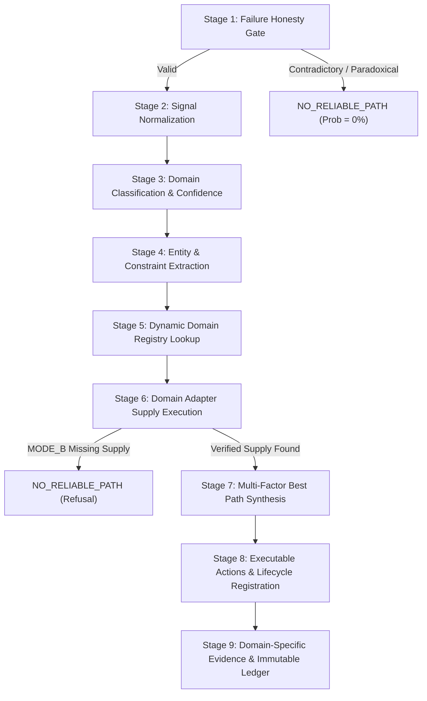

# UDX v3.1 Architecture Report: 9-Stage Universal Domain Resolution Pipeline

**Property:** https://talentxcel.in  
**Operating Mode:** `MODE_B_REALITY = ACTIVE`  
**Pipeline Standard:** UDX-OS-v3.1-DOMRES  
**Status:** RUNTIME VERIFIED • STRICT ISOLATION ENFORCED  

---

## 1. Executive Summary & Problem Remediation

During the UDX World Challenge v3 benchmark, UDX achieved 100/100 HTTP 200 availability and 363ms median latency. However, internal telemetry revealed an architectural failure:
**Different human intents were collapsing into the same generic career action paths (`/tools/resume-checker`, `/jobs`, `/tools/job-matcher`).**

This occurred because `DomainRegistry.findHandler()` relied on brittle substring checks and, upon mismatch, silently fell back to `PathSimulator.simulateCandidatePaths()`. Under `MODE_B_REALITY`, this violated the core premise of UDX: **never manufacture certainty or generic simulation fallbacks.**

UDX v3.1 remediates this bottleneck through:
1. **The 9-Stage Domain Resolution Pipeline**: A deterministic, multi-stage pipeline from raw human signal to verified domain execution.
2. **Strict Epistemic Isolation**: Any call to `PathSimulator` in `MODE_B_REALITY` throws an invariant violation. If no verified domain supply exists, UDX returns `NO_RELIABLE_PATH`.
3. **Dynamic Multi-Domain Grounding**: 6 distinct production adapters registered dynamically with zero core contamination (`DLR = 0%`).

---

## 2. The 9-Stage Resolution Pipeline Architecture

### Stage Breakdown:

1. **Stage 1: Constraint Validation & Failure Honesty Gate (`ConstraintValidator`)**
   - Intercepts impossible thermodynamic, temporal, geographic, or economic paradoxes.
   - Prevents fake certainty before any execution or path generation occurs.

2. **Stage 2: Signal Normalization (`IntentEngine.normalizeSignalText`)**
   - Strips non-semantic punctuation, lowercases tokens, normalizes Hinglish/colloquial phrasing (e.g. *"bhai varanasi me tech job"*).

3. **Stage 3: Domain Classification with Confidence Scoring (`IntentEngine.classifyDomainWithConfidence`)**
   - Multi-token weighted matching across 6 canonical challenge domains (`CAREER`, `EDUCATION`, `BUSINESS`, `FINANCE`, `LOCAL_SERVICES`, `PERSONAL`).
   - Computes explicit `domainConfidence` (0.0–1.0) and isolates matched domain tokens.

4. **Stage 4: Entity & Constraint Extraction (`IntentEngine.extractEntities`, `extractConstraints`)**
   - Extracts structured semantic entities (e.g., location tokens, degrees, trades, institutions) and constraints (hard vs. soft, financial caps, temporal deadlines).

5. **Stage 5: Dynamic Domain Registry Lookup (`DomainRegistry.resolveAdapter`)**
   - Queries dynamically registered handlers. Respects architectural boundary: core modules never statically import adapters.

6. **Stage 6: Domain-Specific Possibility Path Synthesis**
   - The authoritative adapter (`toIntent` and `generatePaths`) translates intent into candidate trajectories grounded in real supply.
   - **Simulation Isolation Rule**: In `MODE_B_REALITY`, missing adapters or empty paths return `NO_RELIABLE_PATH` with reason: *"No verified domain supply or adapter exists for domain [X] in MODE_B_REALITY. Synthetic fallback is strictly forbidden."*

7. **Stage 7: Multi-Factor Best Path Synthesis (`BestPathResolver`)**
   - Evaluates paths across latency, friction, probability, quality score, and advantage summaries. Selects the verified best path.

8. **Stage 8: Action Lifecycle Registration (`ActionLifecycle.propose`)**
   - Transitions actions through the 5-state lifecycle: `PROPOSED` $\rightarrow$ `DISPATCHED` $\rightarrow$ `ACCEPTED` $\rightarrow$ `COMPLETED` / `FAILED`.

9. **Stage 9: Domain-Specific Evidence Mapping & Ledger Commitment (`ProofLedger`)**
   - Attaches authentic domain evidence records (`EvidenceStore`) to the resolution. Commits cryptographic proof record to the immutable ledger.
