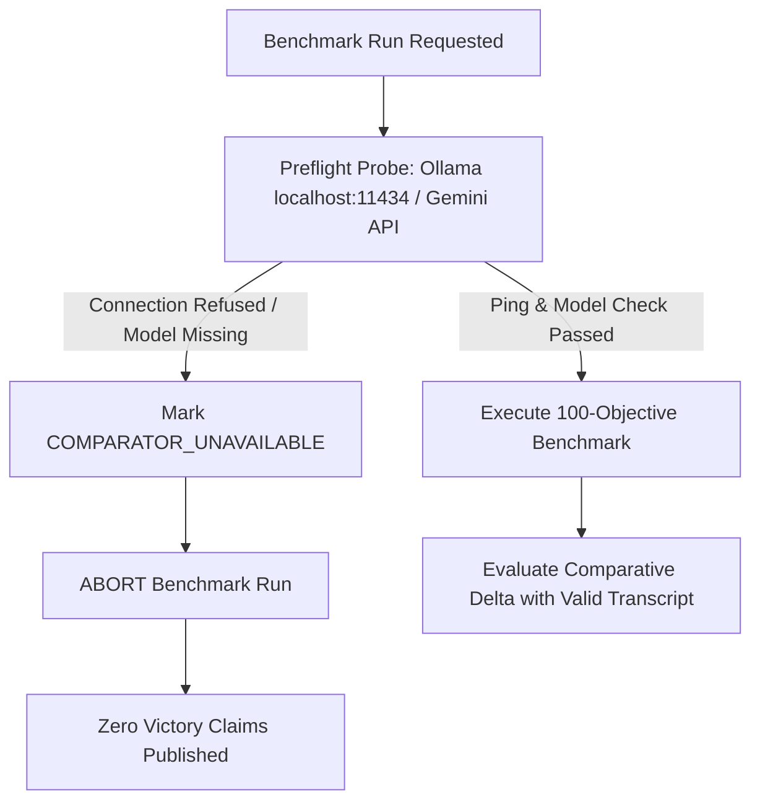

# UDX v3.1 Generic AI Comparator Preflight Protocol

**Protocol Version:** UDX-PREFLIGHT-v3.1  
**Operating Rule:** Rule 14 (Strict Verification of External Baselines)  
**Status:** ENFORCED  

---

## 1. Background & Context

In the UDX World Challenge v3 benchmark, the external Generic AI comparator (local Ollama `phi3:mini`) was unreachable on `localhost:11434`. Rather than converting this network absence into a fraudulent "UDX beats Generic AI 100/100" claim, the benchmark report correctly and honestly marked the comparison as `COMPARATOR_UNAVAILABLE` and refused to claim a competitive victory.

UDX v3.1 formalizes this integrity safeguard into a mandatory **Preflight Protocol**.

---

## 2. Comparator Preflight Specification (Rule 14)



### Preflight Steps:

1. **Connectivity Probe:**
   - Probe HTTP endpoint (`http://localhost:11434/api/tags` for Ollama or Google Gemini health endpoint).
   - Require HTTP 200 within 2,000ms.

2. **Model Availability Verification:**
   - Verify that the target comparator model (e.g. `phi3:mini`, `llama3:8b`, or `gemini-1.5-flash`) is actively loaded in memory and capable of generating responses.

3. **Handshake Verification Test:**
   - Issue a standardized dry-run prompt: `"Ping: return JSON { status: 'ready' }"`
   - Validate that the response is parseable JSON within 3,000ms.

---

## 3. Strict Preflight Invariants

1. **No Conversion to Zero:**
   If the comparator is unavailable, its score is **NULL / UNAVAILABLE**, never `0.00`. An offline baseline does not constitute an empirical defeat.
2. **Benchmark Abort Gate:**
   Any benchmark script attempting to evaluate competitive advantage without a passing preflight check will exit with code 1:
   ```
   [PREFLIGHT ERROR]: External comparator unavailable. Competitive benchmark cannot proceed without live comparator baseline.
   ```
3. **Audited Transcripts:**
   Every reported Generic AI response must have its complete, untruncated transcript and latency logged alongside UDX's response.
