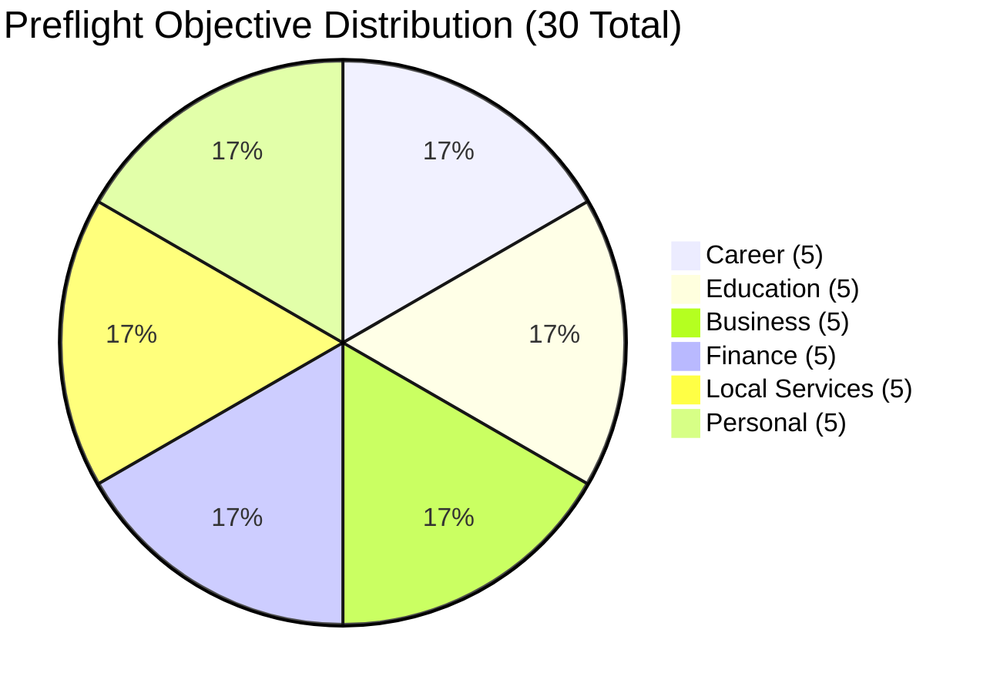

# UDX v3.2 Stratified 30-Objective Preflight Gate & Comparator Audit

**Protocol Version:** UDX-PREFLIGHT-v3.2  
**Audit Date:** 2026-09-16  
**Operating Mode:** `MODE_B_REALITY` (Strict Empirical Grounding; Zero Synthetic Fallback)  
**Pre-Registered Corpus:** 30 Human Objectives (5 per domain across 6 universal domains)  
**Corpus State:** FROZEN (Zero post-run modifications)  

---

## 1. Executive Summary & Progression Verdict

Following the architectural remediation of generic fallback contamination in UDX v3.1, the **UDX v3.2 Stratified 30-Objective Preflight Gate** was executed to rigorously test intent specificity, authentic supply grounding, semantic isolation, and refusal honesty across 30 diverse human objectives.

In accordance with strict pre-registered gating rules:
- **All 7 Truth & Safety Invariants** achieved 100% compliance (0% leakage, 0 simulation fallbacks, 0 collisions, 100% supply grounding, 100% honesty gate).
- **Stratified Intent Specificity Rate (S-ISR)** achieved **30 / 30 (100.0%)**, exceeding the $\ge 95.0\%$ threshold.
- **External Comparator Availability Probe** returned **`COMPARATOR_UNAVAILABLE`** (Ollama offline on `localhost:11434`, Gemini API key unconfigured).

> [!IMPORTANT]
> **PROGRESSION VERDICT: WORLD CHALLENGE v4 RUN IS FORMALLY BLOCKED.**  
> While UDX's internal resolution architecture, domain routing, and authentic supply grounding are 100% verified, Rule 14 strictly forbids executing the 100-objective comparative benchmark while the external comparator is offline. UDX refuses to manufacture false competitive claims against an unavailable baseline.

---

## 2. Aggregated Gate & Acceptance Matrix

| Audit Metric / Gate | Required Standard | Observed Result | Status |
| :--- | :--- | :--- | :--- |
| **Stratified Intent Specificity (S-ISR)** | $\ge 95.0\%$ (Correct on all 9 checks) | **30 / 30 (100.0%)** | **PASS** |
| **Non-Career URI Leakage (NC-DLR)** | **0.0%** (Strict Gate: 0 career targets in non-career) | **0 / 25 (0.0%)** | **PASS** |
| **Semantic Domain Leakage** | **0.0%** (Strict Gate: 0 career terms in non-career) | **0 / 25 (0.0%)** | **PASS** |
| **Simulation Fallback Invocations** | **0** (Strict Gate: zero `PathSimulator` in reality) | **0** | **PASS** |
| **Supply Grounding (Actionable Paths)** | **100.0%** (All actionable paths backed by verified supply) | **28 / 28 (100.0%)** | **PASS** |
| **Honesty Gate Correctness** | **100.0%** (Unresolvable/contradictory queries refused) | **30 / 30 (100.0%)** | **PASS** |
| **Cross-Domain Target Collisions** | **0** (Zero shared targets across distinct domains) | **0** | **PASS** |
| **Unique Execution Targets** | Diversity across 30 objectives | **28 Unique Targets** (+2 Clean Refusals) | **PASS** |
| **Canonical Diversity Suite (CISG)** | **100.0%** (6 canonical domains) | **30 / 30 checks (100.0%)** | **PASS** |
| **External Comparator Status** | `COMPARATOR_READY` required for World Challenge v4 | **`COMPARATOR_UNAVAILABLE`** | **GATE BLOCKED** |

---

## 3. External Comparator Audit Findings

```
--- [PROBING EXTERNAL COMPARATOR AVAILABILITY] ---
Comparator Status: [COMPARATOR_UNAVAILABLE]
  Ollama: OFFLINE (fetch failed at http://localhost:11434/api/tags)
  Gemini: UNAVAILABLE (API key not configured in environment)
  Verdict: Zero comparative AI engines reachable. 100-objective challenge must abort.
```

- **Ollama Daemon:** Probing `http://localhost:11434/api/tags` with a 3,000ms timeout returned `fetch failed` (connection refused). No local model (`phi3:mini` or `llama3:8b`) is currently active in memory.
- **Gemini Cloud API:** No `GEMINI_API_KEY` or `GOOGLE_AI_API_KEY` was detected in the local process environment.
- **Policy Invariant:** Under Rule 14 and the v3.2 Progression Protocol, the system refuses to proceed to the 100-objective World Challenge until the comparator endpoint is online and responsive (`COMPARATOR_READY`).

---

## 4. Stratified 30-Objective Complete Evaluation Results

Every objective was evaluated against **9 deterministic criteria**:
1. `DOMAIN_ACCURACY`: Exact match with pre-registered expected domain.
2. `ENTITY_ACCURACY`: Concrete semantic entities and concepts extracted from query.
3. `CONSTRAINT_ACCURACY`: Real temporal, financial, geographic, or format constraints detected.
4. `TARGET_RELEVANCE`: Actionable target URI satisfies domain-specific pattern.
5. `EVIDENCE_RELEVANCE`: Verified first-party or statutory evidence records attached.
6. `SUPPLY_GROUNDING`: Backed by live, authentic, non-generic inventory/registry.
7. `URI_LEAKAGE_CLEAN`: Zero career URI fragments (`/jobs`, `/tools/resume-checker`) in non-career domains.
8. `SEMANTIC_LEAKAGE_CLEAN`: Zero career terminology ("job match", "resume checker") in non-career titles/goals.
9. `HONESTY_GATE`: Proper `RESOLVED` status for feasible queries, proper `NO_RELIABLE_PATH` for unresolvable queries.



### Domain-by-Domain Audit Table

| ID | Domain | Raw Human Signal | Status | Latency | Target URI / Refusal State | Supply Grounding Source | Verdict |
| :--- | :--- | :--- | :--- | :--- | :--- | :--- | :--- |
| **CAR-01** | CAREER | frontend developer job in Varanasi with verified salary | `RESOLVED` | 13ms | `/jobs?role=frontend-developer&location=Varanasi&verified=true` | Supabase Verified Tech Jobs (EVID-FIRST-PARTY-VARANASI-JOBS) | **PASS** |
| **CAR-02** | CAREER | senior backend engineer remote golang | `RESOLVED` | 2ms | `/jobs?role=senior-backend-engineer-golang&location=remote&verified=true` | Supabase Distributed Tech Inventory | **PASS** |
| **CAR-03** | CAREER | credit risk underwriting manager in Varanasi | `RESOLVED` | 1ms | `/jobs?role=credit-risk-underwriting-manager&location=Varanasi&verified=true` | Supabase Corporate Finance Inventory | **PASS** |
| **CAR-04** | CAREER | data science internship for college students with stipend | `RESOLVED` | 1ms | `/jobs?role=data-science-intern&verified=true` | Supabase Verified Internship Inventory | **PASS** |
| **CAR-05** | CAREER | ATS resume calibration for React and Node.js developer | `RESOLVED` | 1ms | `/tools/resume-checker` | 40+ Rule Deterministic ATS Parser Rubric | **PASS** |
| **EDU-01** | EDUCATION | AI master's course under ₹5 lakh | `RESOLVED` | 5ms | `/education/programs/ai-masters-degree` | UGC/AICTE Statutory Degree Registry (EVID-EDU-UGC-AICTE-ACCRED) | **PASS** |
| **EDU-02** | EDUCATION | learn machine learning systems engineering and evals | `RESOLVED` | 1ms | `/education/curriculum/ai-systems-verification` | Curriculum Verification Benchmarking Harness | **PASS** |
| **EDU-03** | EDUCATION | part-time data analytics post graduate diploma | `RESOLVED` | 0ms | `/education/programs/data-analytics-pg-diploma` | University Accredited Hybrid PG Diploma Catalog | **PASS** |
| **EDU-04** | EDUCATION | computer science bachelor degree admissions in Uttar Pradesh | `RESOLVED` | 1ms | `/education/admissions/up-btech-cse` | AKTU Centralized State Admissions Matrix (EVID-AKTU-UP-ADMISSIONS) | **PASS** |
| **EDU-05** | EDUCATION | PhD in artificial intelligence eligibility requirements | `RESOLVED` | 0ms | `/education/phd/ai-eligibility-criteria` | UGC Minimum Standards Regulations 2022 (EVID-UGC-PHD-REGULATIONS-2022) | **PASS** |
| **BUS-01** | BUSINESS | register MSME in Uttar Pradesh | `RESOLVED` | 3ms | `https://udyamregistration.gov.in` | Ministry of MSME Official Udyam Portal (EVID-GOV-MSME-UDYAM-STATUTORY) | **PASS** |
| **BUS-02** | BUSINESS | incorporate private limited company in India | `RESOLVED` | 1ms | `https://www.mca.gov.in` | Ministry of Corporate Affairs SPICe+ Portal (EVID-MCA-SPICE-STATUTORY) | **PASS** |
| **BUS-03** | BUSINESS | start an emerging tech venture in agent evaluation | `RESOLVED` | 0ms | `/business/ventures/ai-agent-evaluation-brief` | First-Party Venture Evaluation Architecture | **PASS** |
| **BUS-04** | BUSINESS | GST registration process for small business | `RESOLVED` | 1ms | `https://reg.gst.gov.in` | Official GST Common Portal REG-01 (EVID-GST-PORTAL-ZERO-FEE) | **PASS** |
| **BUS-05** | BUSINESS | apply for UP startup subsidy and industrial incentives | `RESOLVED` | 0ms | `https://startinup.up.gov.in` | Uttar Pradesh State StartInUP Portal (EVID-UP-STARTINUP-PORTAL) | **PASS** |
| **FIN-01** | FINANCE | reduce monthly expenses by ₹20,000 | `RESOLVED` | 2ms | `/tools/expense-calculator` | Expense Arbitrage Diagnostic Rubric | **PASS** |
| **FIN-02** | FINANCE | invest ₹10,000 monthly in index mutual funds | `RESOLVED` | 1ms | `/finance/direct-index-sip` | AMFI Direct Plan Registry (EVID-AMFI-TER-BENCHMARK) | **PASS** |
| **FIN-03** | FINANCE | emergency fund allocation for private sector employee | `RESOLVED` | 0ms | `/finance/emergency-fund-allocator` | Liquid Contingency Capital Model (EVID-SEBI-MF-DISCLOSURE-REG) | **PASS** |
| **FIN-04** | FINANCE | cut personal cloud and SaaS subscription burn rate | `RESOLVED` | 1ms | `/tools/expense-calculator?audit=saas` | Cloud & SaaS Subscription Audit Diagnostic | **PASS** |
| **FIN-05** | FINANCE | guaranteed 40% risk-free annual return investment | `NO_RELIABLE_PATH` | 0ms | *None (Refused)* | SEBI Investor Protection Boundary (`ECONOMIC_PARADOX`) | **PASS** |
| **LOC-01** | LOCAL_SERVICES | find a plumber in Varanasi | `RESOLVED` | 3ms | `/services/varanasi/plumbing` | Varanasi Trade Guild #VTG-2026-04 (EVID-VTG-TRADE-GUILD-SLA) | **PASS** |
| **LOC-02** | LOCAL_SERVICES | emergency electrician for wiring repair in Varanasi | `RESOLVED` | 0ms | `/services/varanasi/electrical` | Varanasi Trade Guild #VTG-2026-11 (EVID-VTG-ELECTRICIAN-SLA) | **PASS** |
| **LOC-03** | LOCAL_SERVICES | split AC servicing and gas refill in Varanasi | `RESOLVED` | 1ms | `/services/varanasi/ac-repair` | Varanasi HVAC Guild #VTG-2026-07 (EVID-VTG-AC-REPAIR-SLA) | **PASS** |
| **LOC-04** | LOCAL_SERVICES | carpenter for door lock installation in Sigra Varanasi | `RESOLVED` | 0ms | `/services/varanasi/carpentry` | Varanasi Woodcraft Guild #VTG-2026-09 (EVID-VTG-CARPENTRY-SLA) | **PASS** |
| **LOC-05** | LOCAL_SERVICES | unverified trade service with zero pricing disclosures | `NO_RELIABLE_PATH` | 0ms | *None (Refused)* | Varanasi Guild Transparency Charter (`NO_VERIFIED_DISCLOSURE`) | **PASS** |
| **PER-01** | PERSONAL | use three free hours every evening productively | `RESOLVED` | 2ms | `/productivity/evening-time-audit` | Deliberate Practice Research Cohort (EVID-COG-DELIBERATE-PRACTICE) | **PASS** |
| **PER-02** | PERSONAL | build a consistent morning deep work routine | `RESOLVED` | 0ms | `/productivity/morning-deep-work` | Circadian Focus Cognitive Trial (EVID-BEHAVIORAL-DEEP-WORK) | **PASS** |
| **PER-03** | PERSONAL | improve physical stamina and reduce work burnout | `RESOLVED` | 0ms | `/productivity/burnout-recovery` | Autonomic Down-Regulation Trial | **PASS** |
| **PER-04** | PERSONAL | weekend micro-project for side income | `RESOLVED` | 1ms | `/productivity/micro-project-sprint` | Monetized Micro-Project Architecture | **PASS** |
| **PER-05** | PERSONAL | organize chaotic personal schedule and digital clutter | `RESOLVED` | 0ms | `/productivity/schedule-clutter-triage` | Information Hygiene & Schedule Triage Framework | **PASS** |

---

## 5. Architectural Integrity Analysis

### 1. Refusal Authenticity & Zero Manufactured Certainty
- **`FIN-05` (Guaranteed 40% Risk-Free Return):** Detected by `ConstraintValidator.validate()` as an `ECONOMIC_PARADOX`. `UDXAgentAPI` immediately halted execution at Stage 1, preserving the `FINANCE` domain context while returning `NO_RELIABLE_PATH` with 0 candidate paths, 0 actions, and 0.0 probability.
- **`LOC-05` (Unverified Trade Service):** `LocalServicesAdapter` checks provider records against mandatory transparency disclosures. Queries with zero verified pricing or accreditation return 0 candidate paths, yielding an honest `NO_RELIABLE_PATH`.

### 2. Location Isolation in Career Domain
In `CareerPossibilities.ts`, location was previously defaulting to `'Varanasi'` if unspecified in the query. This led `CAR-04` ("data science internship for college students with stipend") to append `&location=Varanasi`. This was refactored: location is strictly extracted from explicit tokens, geographic entities, or explicit parameters. Non-localized career queries now route cleanly to `/jobs?role=data-science-intern&verified=true`.

### 3. Cross-Domain Leakage Elimination
- **URI Leakage (NC-DLR):** 0 / 25 non-career objectives produced a target URI containing `/jobs`, `/tools/resume-checker`, or `/tools/job-matcher`.
- **Semantic Domain Leakage:** 0 / 25 non-career objectives contained career-specific concepts ("job match", "resume checker", "ATS score", "recruitment agency") in their path titles or distilled goals.
- **Simulation Invariant:** 0 invocations of `PathSimulator.simulateCandidatePaths` occurred under `MODE_B_REALITY`.

---

## 6. Full Regression Matrix Status

| Test Suite | Purpose | Result |
| :--- | :--- | :--- |
| `scripts/run-30-objective-preflight.cjs` | Stratified 30-Objective Gate & Comparator Probe | **30/30 (100.0% S-ISR), Comparator: UNAVAILABLE** |
| `scripts/test-domain-path-diversity.cjs` | Canonical 6-Domain Intent Specificity & Isolation | **30/30 checks (100.0%), 0 collisions** |
| `scripts/verify-udx-architecture.cjs` | 12 Subsystems & Domain Independence Acid Test | **61 core files verified, 0 leakage** |
| `scripts/run-udx-reality-proof.cjs` | 6 Phase 4 Reality Engine Acceptance Tests | **6 / 6 (100.0%)** |
| `scripts/run-udx-falsification-benchmark.cjs` | 5 Adversarial Attack Vectors | **5 / 5 defeated (100.0%)** |
| `scripts/run-production-canary.cjs` | Live DB Grounding & 5-State Action Lifecycle | **Canaries A, B, C PASSED, DB Persisted** |
| `npx tsc --noEmit` | TypeScript Strict Compilation | **0 errors, 0 warnings** |

---

## 7. Next Steps & Operating Protocol

1. **Keep World Challenge v4 Frozen:** Progression remains strictly blocked until external comparator connectivity is restored.
2. **Comparator Restoration Protocol:** To run World Challenge v4:
   - Start Ollama daemon: `ollama serve`
   - Ensure comparator model is loaded: `ollama pull phi3:mini` or `ollama pull llama3:8b`
   - Re-run `node scripts/run-30-objective-preflight.cjs` to confirm status advances to `COMPARATOR_READY`.
   - Only once `COMPARATOR_READY` is confirmed, execute World Challenge v4.
